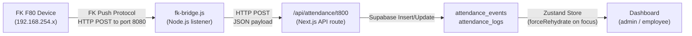
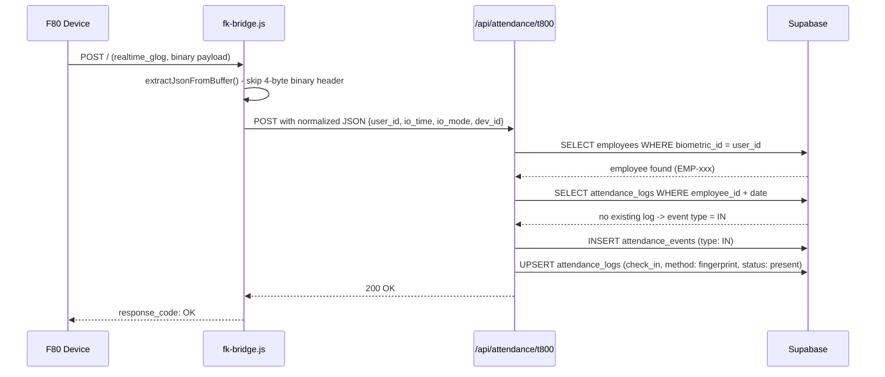

# Biometric Integration Documentation - NexHRMS v2

## Overview

This document covers the complete integration of the FK F80 biometric device with the NexHRMS v2 HR management system for real-time employee attendance tracking (clock-in and clock-out).

**Date Completed:** May 20, 2026
**Device:** FK F80 (face + fingerprint recognition)
**Protocol:** FK HTTP Push (Internet mode)
**Bridge Port:** 8080
**Target API:** http://localhost:3000/api/attendance/t800

## Architecture



## Components

| Component          | File                   | Role                                                                                                                                               |
| ------------------ | ---------------------- | -------------------------------------------------------------------------------------------------------------------------------------------------- |
| FK Bridge          | fk-bridge.js           | Node.js HTTP server on port 8080. Receives raw FK binary payloads from device, extracts JSON, normalizes fields, and forwards to Next.js API       |
| T800 API Route     | route.ts               | Processes forwarded scans. Looks up employee by biometric_id, determines IN/OUT event type, writes to Supabase attendance_events + attendance_logs |
| Attendance Store   | attendance.store.ts    | Client-side Zustand store. Rehydrates from Supabase on tab focus. Feeds dashboard components                                                       |
| Admin Dashboard    | admin-dashboard.tsx    | KPI stats (present/absent/on leave), attendance trend chart, pending actions                                                                       |
| Employee Dashboard | employee-dashboard.tsx | Personal attendance status, today's check-in/out, leave balance                                                                                    |
| Auth Service       | auth.service.ts        | Employee CRUD - includes biometric_id field mapping                                                                                                |

## Setup Instructions

### 1. Device Configuration (F80)

| Setting     | Value                                        | Location on Device |
| ----------- | -------------------------------------------- | ------------------ |
| Mode        | Internet                                     | Comm -> Mode       |
| Server IP   | Your laptop's WiFi IP (e.g. 192.168.254.157) | Comm -> Server     |
| Server Port | 8080                                         | Comm -> Port       |

[!IMPORTANT]
Mode must be set to Internet (not Local). Local mode is passive - the device waits to be polled. Internet mode actively pushes scans to the configured server.

### 2. Enroll Users on Device

1. F80 -> Menu -> User -> New User
2. Enter a name and register face/fingerprint
3. Device assigns a User ID (e.g. 12, 32, 36)
4. Note this ID - you'll map it in NexHRMS

### 3. Map Biometric ID in NexHRMS

1. Log in as admin -> Employees -> select employee -> Edit
2. Set Biometric ID = device User ID
3. Save

### 4. Run the System

Open two terminals:

**Terminal 1 - Next.js dev server**

```
npm run dev
```

**Terminal 2 - Biometric bridge**

```
npm run biometric:bridge
```

Bridge ready when you see:

```
[info] bridge listening {"port":8080,"target":"http://localhost:3000/api/attendance/t800",...}
```

Device connected when you see:

```
[info] post request received {...,"requestCode":"receive_cmd",...}
```

## Data Flow - Step by Step

### Clock-In (First Scan of Day)



## NOTE: From this onward, currently fixing bugs. Thanks !

### Clock-Out (Second Scan of Day)

Same flow, but:

- Existing log found with check_in set, check_out null
- inferEventType() returns "OUT"
- Updates attendance_logs with check_out, check_out_method: "fingerprint", and calculates hours

## Logic Rules

| Condition                                        | Result                              |
| ------------------------------------------------ | ----------------------------------- |
| No log today                                     | Clock IN                            |
| Has check_in, no check_out                       | Clock OUT                           |
| Has both check_in and check_out                  | Silently ignored (one pair per day) |
| Employee not found / inactive                    | Silently ignored                    |
| Check-in via web/QR, scan on device for checkout | Blocked (same-method rule)          |
| Check-in via device, checkout via device         | ✅ Allowed                          |
| Admin manual override for checkout               | ✅ Always allowed                   |
