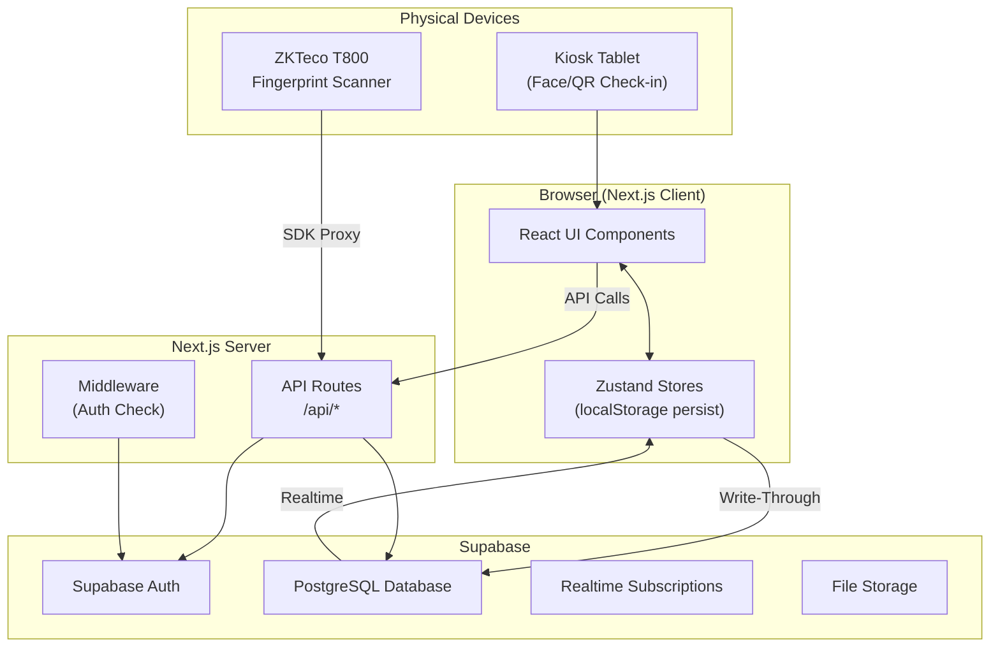
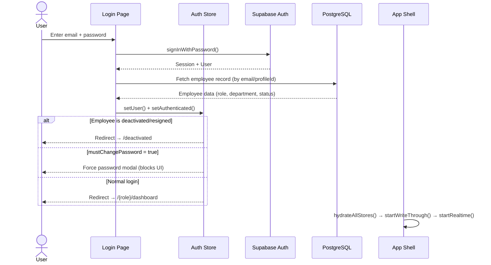
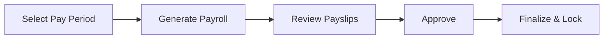
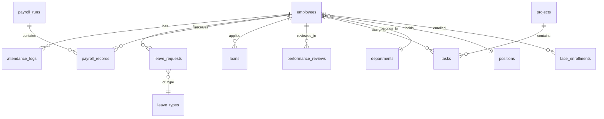
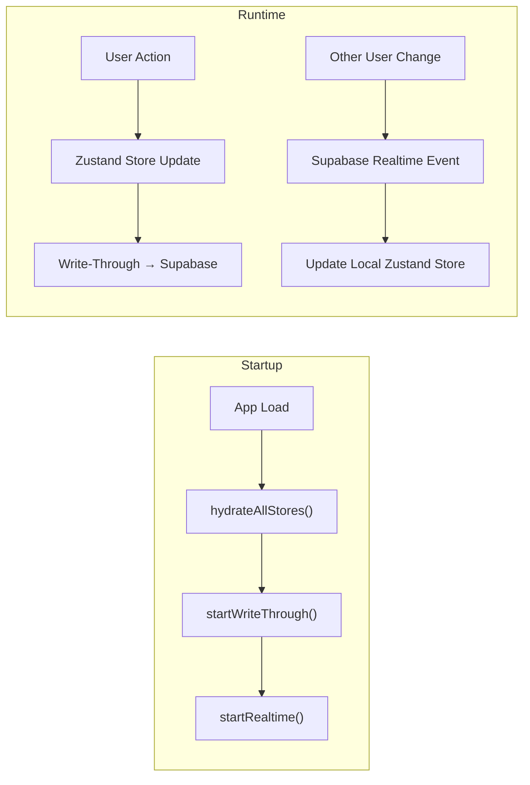

# NexHRIS v2 — System Documentation (Turnover File)

> **Version:** 2.0  
> **Last Updated:** May 22, 2026  
> **Project:** NexHRIS (Human Resource Information System)  
> **Repository:** `NexHRMS-v2`  
> **Stack:** Next.js 14 · TypeScript · React 18 · Supabase · Zustand

---

## Table of Contents

1. [System Overview](#1-system-overview)
2. [Tech Stack](#2-tech-stack)
3. [Project Structure](#3-project-structure)
4. [Architecture](#4-architecture)
5. [Authentication Flow](#5-authentication-flow)
6. [Role-Based Access Control](#6-role-based-access-control)
7. [Module Reference](#7-module-reference)
8. [API Routes](#8-api-routes)
9. [Database Schema](#9-database-schema)
10. [State Management (Zustand Stores)](#10-state-management-zustand-stores)
11. [Data Sync Architecture](#11-data-sync-architecture)
12. [Kiosk & Biometric Systems](#12-kiosk--biometric-systems)
13. [Philippine Payroll Compliance](#13-philippine-payroll-compliance)
14. [Environment Variables](#14-environment-variables)
15. [Deployment](#15-deployment)
16. [Getting Started (Dev Setup)](#16-getting-started-dev-setup)

---

## 1. System Overview

NexHRIS v2 is a **Philippine-focused Human Resource Information System** built as a modern web application. It provides end-to-end HR management including employee records, attendance tracking, leave management, payroll processing, performance reviews, and more.

### Core Design Pillars

| Pillar | Description |
|--------|-------------|
| **Philippine Compliance** | SSS, PhilHealth, Pag-IBIG, BIR withholding tax, 13th month pay, de minimis benefits |
| **Offline-First** | Zustand stores persist to localStorage; app functions without network, syncs when online |
| **Role-Based Access** | 5 roles (superadmin → employee) with per-page access control |
| **Multi-Mode** | Demo mode (localStorage only) and Production mode (Supabase backend) |
| **Real-Time** | Supabase Realtime subscriptions push live updates across users |

### Two Operating Modes

| Mode | Env Variable | Backend | Use Case |
|------|-------------|---------|----------|
| **Demo** | `NEXT_PUBLIC_USE_DEMO_MODE=true` | localStorage with seeded data | Development, demos, testing |
| **Production** | `NEXT_PUBLIC_USE_DEMO_MODE=false` | Supabase (PostgreSQL) | Live deployment |

---

## 2. Tech Stack

| Category | Technology | Version |
|----------|-----------|---------|
| Framework | Next.js (App Router) | 14.x |
| Language | TypeScript | 5.x |
| UI Library | React | 18.x |
| Styling | Tailwind CSS | 3.x |
| UI Components | shadcn/ui | latest |
| State Management | Zustand (with persist) | 4.x |
| Backend / Database | Supabase (PostgreSQL) | @supabase/supabase-js 2.x |
| Forms | React Hook Form | 7.x |
| Validation | Zod | 3.x |
| Data Tables | @tanstack/react-table | 8.x |
| Charts | Recharts | 2.x |
| Date Handling | date-fns | 3.x |
| Icons | Lucide React | latest |
| Toast Notifications | Sonner | latest |
| Face Recognition | face-api.js / TensorFlow.js | — |
| Deployment | Vercel | — |
| Database | Supabase PostgreSQL | — |

---

## 3. Project Structure

```
NexHRMS-v2/
├── src/
│   ├── app/                    # Next.js App Router pages
│   │   ├── [role]/             # Role-prefixed routes (dynamic segment)
│   │   │   ├── dashboard/
│   │   │   ├── employees/
│   │   │   ├── employee/
│   │   │   ├── attendance/
│   │   │   ├── leave/
│   │   │   ├── payroll/
│   │   │   ├── my-payslips/
│   │   │   ├── timesheets/
│   │   │   ├── performance/
│   │   │   ├── loans/
│   │   │   ├── disciplinary/
│   │   │   ├── jobs/
│   │   │   ├── projects/
│   │   │   ├── tasks/
│   │   │   ├── events/
│   │   │   ├── messages/
│   │   │   ├── notifications/
│   │   │   ├── reports/
│   │   │   ├── settings/
│   │   │   ├── profile/
│   │   │   ├── audit/
│   │   │   ├── biometric/
│   │   │   ├── face-enrollment/
│   │   │   └── custom/
│   │   ├── api/                # API routes (server-side)
│   │   ├── kiosk/              # Self-service kiosk (no auth)
│   │   ├── checkin/            # QR check-in endpoint
│   │   ├── login/              # Login page
│   │   ├── deactivated/        # Deactivated account page
│   │   ├── client-layout.tsx   # Root client layout (auth guards, sync)
│   │   ├── layout.tsx          # Root server layout
│   │   └── globals.css         # Global styles
│   ├── components/             # Reusable UI components
│   │   ├── shell/              # App shell (sidebar, header, theme)
│   │   ├── ui/                 # shadcn/ui primitives
│   │   ├── dashboard/          # Dashboard-specific components
│   │   └── ...                 # Module-specific component dirs
│   ├── data/                   # Static data, nav config, demo seeds
│   ├── features/               # Feature-level logic/components
│   ├── hooks/                  # Custom React hooks
│   ├── lib/                    # Utility functions
│   ├── services/               # Business logic & API services
│   ├── store/                  # Zustand state stores
│   ├── types/                  # TypeScript type definitions
│   └── proxy.ts                # Biometric device proxy
├── supabase/                   # Supabase migrations & config
├── public/                     # Static assets
├── scripts/                    # Utility scripts
├── docs/                       # Additional documentation
└── physicalsdk/                # Biometric SDK files
```

---

## 4. Architecture

### High-Level Data Flow



### Request Lifecycle

1. **Page Load** → Middleware checks Supabase session cookie
2. **Auth Guard** → `client-layout.tsx` validates auth state, redirects if needed
3. **Role Guard** → `[role]/layout.tsx` validates URL role matches user role
4. **Data Hydration** → `sync.service.ts` loads all stores from Supabase
5. **Realtime** → Supabase subscriptions keep stores updated
6. **Write-Through** → Local store changes auto-persist to Supabase

---

## 5. Authentication Flow

### Login Sequence



### Key Auth Files

| File | Purpose |
|------|---------|
| [login/page.tsx](file:///c:/Repository/NexHRMS-v2/src/app/login/page.tsx) | Login page (demo mode picker + Supabase login form) |
| [client-layout.tsx](file:///c:/Repository/NexHRMS-v2/src/app/client-layout.tsx) | Auth guards, deactivation check, force password change, sync bootstrap |
| [auth.store.ts](file:///c:/Repository/NexHRMS-v2/src/store/auth.store.ts) | Auth state management (user, role, isAuthenticated) |
| [supabase-browser.ts](file:///c:/Repository/NexHRMS-v2/src/services/supabase-browser.ts) | Browser Supabase client, session helpers, auth error suppression |
| [supabase-server.ts](file:///c:/Repository/NexHRMS-v2/src/services/supabase-server.ts) | Server-side Supabase client for API routes |

### Auth Guards (3 Layers)

| Layer | Location | Logic |
|-------|----------|-------|
| **Middleware** | `middleware.ts` | Server-side: checks session cookie; redirects unauthenticated to `/login` |
| **Client Auth** | `client-layout.tsx` | Client-side: verifies `isAuthenticated`; handles deactivated employees |
| **Role Prefix** | `[role]/layout.tsx` | Validates URL role segment matches `currentUser.role` |

### Bypass Routes (No Auth Required)

- `/login`
- `/kiosk` and `/kiosk/*`
- `/checkin`
- `/api/*`
- `/deactivated`

---

## 6. Role-Based Access Control

### Roles

| Role | Level | Description |
|------|-------|-------------|
| `superadmin` | 1 (highest) | Full system access, multi-tenant management |
| `admin` | 2 | Company-level administrator, full HRMS access |
| `hr` | 3 | HR department staff, manages employees/payroll/leave |
| `manager` | 4 | Department manager, approves team requests |
| `employee` | 5 (lowest) | Regular employee, self-service only |

### Route Pattern

All authenticated routes follow: `/{role}/{module}`

```
/admin/dashboard
/hr/employees
/employee/leave
/manager/attendance
```

The `[role]` dynamic segment is validated — users cannot access routes with a different role prefix.

### Page Access Matrix

| Module / Page | Route | superadmin | admin | hr | manager | employee |
|---------------|-------|:---:|:---:|:---:|:---:|:---:|
| **Dashboard** | `/{role}/dashboard` | ✅ | ✅ | ✅ | ✅ | ✅ |
| **Employees** | `/{role}/employees` | ✅ | ✅ | ✅ | ✅ | ❌ |
| **Employee Detail** | `/{role}/employees/[id]` | ✅ | ✅ | ✅ | ✅ | ❌ |
| **Attendance** | `/{role}/attendance` | ✅ | ✅ | ✅ | ✅ | ✅ |
| **Leave** | `/{role}/leave` | ✅ | ✅ | ✅ | ✅ | ✅ |
| **Timesheets** | `/{role}/timesheets` | ✅ | ✅ | ✅ | ✅ | ✅ |
| **Payroll** | `/{role}/payroll` | ✅ | ✅ | ✅ | ❌ | ❌ |
| **My Payslips** | `/{role}/my-payslips` | ❌ | ❌ | ❌ | ✅ | ✅ |
| **Performance** | `/{role}/performance` | ✅ | ✅ | ✅ | ✅ | ✅ |
| **Loans** | `/{role}/loans` | ✅ | ✅ | ✅ | ✅ | ✅ |
| **Disciplinary** | `/{role}/disciplinary` | ✅ | ✅ | ✅ | ✅ | ❌ |
| **Jobs** | `/{role}/jobs` | ✅ | ✅ | ✅ | ❌ | ❌ |
| **Projects** | `/{role}/projects` | ✅ | ✅ | ✅ | ✅ | ✅ |
| **Tasks** | `/{role}/tasks` | ✅ | ✅ | ✅ | ✅ | ✅ |
| **Events** | `/{role}/events` | ✅ | ✅ | ✅ | ✅ | ✅ |
| **Messages** | `/{role}/messages` | ✅ | ✅ | ✅ | ✅ | ✅ |
| **Notifications** | `/{role}/notifications` | ✅ | ✅ | ✅ | ✅ | ✅ |
| **Reports** | `/{role}/reports` | ✅ | ✅ | ✅ | ❌ | ❌ |
| **Biometric** | `/{role}/biometric` | ✅ | ✅ | ✅ | ❌ | ❌ |
| **Face Enrollment** | `/{role}/face-enrollment` | ✅ | ✅ | ✅ | ✅ | ✅ |
| **Settings** | `/{role}/settings` | ✅ | ✅ | ✅ | ❌ | ❌ |
| **Audit Log** | `/{role}/audit` | ✅ | ✅ | ❌ | ❌ | ❌ |
| **Profile** | `/{role}/profile` | ✅ | ✅ | ✅ | ✅ | ✅ |
| **Custom Pages** | `/{role}/custom` | ✅ | ✅ | ✅ | ✅ | ✅ |
| **Kiosk** | `/kiosk` | — | — | — | — | — |

> [!NOTE]
> Kiosk operates outside the role system — it's a shared, unauthenticated device interface.

### Role-Specific Behavior Within Shared Pages

Several modules render differently based on role:

| Module | Admin/HR View | Manager View | Employee View |
|--------|--------------|--------------|---------------|
| **Dashboard** | Org-wide metrics, department charts, quick admin actions | Team summary, pending approvals | Personal stats, leave balance, recent payslips |
| **Attendance** | All employees, manual entry, overtime approval | Team attendance, overtime approval | Own attendance only |
| **Leave** | All requests, approve/reject, configure types & balances | Team requests, approve/reject | Own requests only, file new leave |
| **Performance** | Configure review cycles, all reviews, reports | Review team members, submit ratings | Self-assessment, view own reviews |
| **Loans** | All loans, approval queue, reports | Team loan approvals | Own loan applications, track status |
| **Timesheets** | All timesheets, bulk approval | Team timesheets, approve/reject | Own timesheet entry, submit for approval |

---

## 7. Module Reference

### 7.1 Dashboard

**Route:** `/{role}/dashboard`  
**Access:** All roles  
**Key File:** [dashboard/page.tsx](file:///c:/Repository/NexHRMS-v2/src/app/[role]/dashboard/page.tsx)

| Widget | Admin/HR/SuperAdmin | Manager | Employee |
|--------|:---:|:---:|:---:|
| Employee count overview | ✅ | ❌ | ❌ |
| Department distribution chart | ✅ | ❌ | ❌ |
| Recent hires | ✅ | ❌ | ❌ |
| Today's attendance overview | ✅ | ✅ (team) | ✅ (self) |
| Pending leave requests | ✅ | ✅ (team) | ❌ |
| Upcoming events | ✅ | ✅ | ✅ |
| Leave balance | ❌ | ✅ | ✅ |
| Recent payslips | ❌ | ✅ | ✅ |
| Task summary | ✅ | ✅ | ✅ |
| Quick actions | Add Employee, Run Payroll | Approve Requests | Request Leave, Clock In |

---

### 7.2 Employees

**Route:** `/{role}/employees` and `/{role}/employees/[id]`  
**Access:** superadmin, admin, hr, manager  
**Key File:** [employees/page.tsx](file:///c:/Repository/NexHRMS-v2/src/app/[role]/employees/page.tsx)

#### List View
- Data table: Name, Employee ID, Department, Position, Status, Employment Type, Date Hired
- Filters: Department, Status (active/inactive/resigned), Employment Type, search
- Add Employee (multi-step form)
- Import from CSV
- Bulk actions: Export CSV, status change

#### Detail View (`[id]`)
Tabbed interface:

| Tab | Content |
|-----|---------|
| **Personal** | Name, contact, address, birthday, gender, civil status, emergency contacts |
| **Employment** | Employee ID, department, position, date hired, type, status, salary grade, reporting manager |
| **Government IDs** | SSS, PhilHealth, Pag-IBIG, TIN numbers |
| **Compensation** | Base salary, allowances, benefits |
| **Documents** | Uploaded document management |
| **Attendance** | Historical attendance records |
| **Leave** | Past/current leave records |
| **Performance** | Reviews and ratings |
| **Disciplinary** | Disciplinary records |
| **Loans** | Loan records |

---

### 7.3 Attendance

**Route:** `/{role}/attendance`  
**Access:** All roles  
**Key File:** [attendance/page.tsx](file:///c:/Repository/NexHRMS-v2/src/app/[role]/attendance/page.tsx)

**Features:**
- Daily attendance log with date picker navigation
- Columns: Employee Name, Department, Time In, Time Out, Status, Overtime, Remarks
- Status types: Present, Absent, Late, Half-day, On Leave
- Filters: Department, Status, search
- Manual attendance entry (admin/HR)
- Overtime request management (log, approve, reject)
- Monthly/weekly summary statistics
- Export to CSV/Excel
- Integrates with biometric/kiosk check-in data

**Check-in Sources:**
- Biometric (ZKTeco T800 fingerprint)
- Face recognition (kiosk camera)
- QR code scan
- Manual entry

---

### 7.4 Leave

**Route:** `/{role}/leave`  
**Access:** All roles  
**Key File:** [leave/page.tsx](file:///c:/Repository/NexHRMS-v2/src/app/[role]/leave/page.tsx)

**Leave Types:**

| Type | Abbreviation |
|------|-------------|
| Vacation Leave | VL |
| Sick Leave | SL |
| Emergency Leave | EL |
| Maternity Leave | ML |
| Paternity Leave | PL |
| Bereavement Leave | BL |
| Solo Parent Leave | SPL |
| Special Leave | — |
| Leave Without Pay | LWOP |

**Features:**
- Leave request filing with date range, type, reason
- Approval workflow: Employee → Manager → HR/Admin
- Leave balance tracking per type
- Leave calendar (team view)
- Balance configuration: annual allocation, carry-over, pro-rata
- Filters: status, type, department, date range

---

### 7.5 Payroll

**Route:** `/{role}/payroll`  
**Access:** superadmin, admin, hr  
**Key File:** [payroll/page.tsx](file:///c:/Repository/NexHRMS-v2/src/app/[role]/payroll/page.tsx)

**Processing Workflow:**



**Pay Schedule:** Semi-monthly (1st–15th, 16th–end of month)

**Payroll Components:**

| Earnings | Deductions |
|----------|------------|
| Basic salary | SSS contribution |
| Overtime pay (125%/130%) | PhilHealth contribution |
| Holiday pay | Pag-IBIG contribution |
| Night differential (10%) | BIR withholding tax |
| Allowances | Loan deductions |
| 13th month pay | Late/absent deductions |
| De minimis benefits | Other deductions |

---

### 7.6 My Payslips

**Route:** `/{role}/my-payslips`  
**Access:** manager, employee  
**Key File:** [my-payslips/page.tsx](file:///c:/Repository/NexHRMS-v2/src/app/[role]/my-payslips/page.tsx)

- Lists logged-in user's payslips (most recent first)
- Shows: Pay period, Gross Pay, Total Deductions, Net Pay, Status
- Detail view: Full earnings/deductions breakdown, YTD totals
- Download/Print as PDF

---

### 7.7 Timesheets

**Route:** `/{role}/timesheets`  
**Access:** All roles  
**Key File:** [timesheets/page.tsx](file:///c:/Repository/NexHRMS-v2/src/app/[role]/timesheets/page.tsx)

- Weekly timesheet grid (daily hours per employee)
- Entries: Date, Time In/Out, Break, Total Hours, Project/Task
- Status: Draft → Submitted → Approved/Rejected
- Auto-populate from attendance data
- Project time association
- Manager/HR: Bulk approval

---

### 7.8 Performance

**Route:** `/{role}/performance`  
**Access:** All roles  
**Key File:** [performance/page.tsx](file:///c:/Repository/NexHRMS-v2/src/app/[role]/performance/page.tsx)

- Review cycles: Quarterly, Semi-Annual, Annual
- Multi-rater reviews (self + manager minimum, optional peers)
- Configurable evaluation criteria/templates
- Rating scale: 1–5 (Needs Improvement → Outstanding)
- KPI tracking per employee/department
- Performance dashboard with trend analysis
- Performance Improvement Plans (PIP) for low performers
- Integration with disciplinary module

---

### 7.9 Loans

**Route:** `/{role}/loans`  
**Access:** All roles  
**Key File:** [loans/page.tsx](file:///c:/Repository/NexHRMS-v2/src/app/[role]/loans/page.tsx)

**Loan Types:** Cash Advance, Salary Loan, Emergency Loan, SSS Loan, Pag-IBIG Loan, Company Loan

**Features:**
- Loan application by employees
- Approval workflow: Employee → Manager → HR/Admin
- Tracks: Outstanding balance, payment schedule, payment history, remaining installments
- Configurable interest rates per loan type
- Auto-deduction from payroll

---

### 7.10 Disciplinary

**Route:** `/{role}/disciplinary`  
**Access:** superadmin, admin, hr, manager  
**Key File:** [disciplinary/page.tsx](file:///c:/Repository/NexHRMS-v2/src/app/[role]/disciplinary/page.tsx)

- Incident reporting with details, witnesses, evidence
- Case status: Open → Under Investigation → Resolved → Closed
- Actions: Verbal Warning, Written Warning, Suspension, Termination
- Progressive discipline tracking (escalation history)
- NTE (Notice to Explain) management
- Hearing/investigation scheduling
- Document attachments

---

### 7.11 Jobs (Recruitment)

**Route:** `/{role}/jobs`  
**Access:** superadmin, admin, hr  
**Key File:** [jobs/page.tsx](file:///c:/Repository/NexHRMS-v2/src/app/[role]/jobs/page.tsx)

- Job posting CRUD: Title, Department, Description, Requirements, Type, Salary Range
- Posting status: Draft, Open, Closed, On Hold
- Applicant tracking pipeline: Applied → Screening → Interview → Offer → Hired/Rejected
- Per-applicant notes
- Job requisition approval workflow

---

### 7.12 Projects

**Route:** `/{role}/projects`  
**Access:** All roles  
**Key File:** [projects/page.tsx](file:///c:/Repository/NexHRMS-v2/src/app/[role]/projects/page.tsx)

- Project CRUD: Name, Description, Dates, Status, Priority, Budget
- Team member assignment
- Status: Planning → In Progress → On Hold → Completed → Cancelled
- Task association (links to Tasks module)
- Time tracking (integrates with Timesheets)
- Budget monitoring

---

### 7.13 Tasks

**Route:** `/{role}/tasks`  
**Access:** All roles  
**Key File:** [tasks/page.tsx](file:///c:/Repository/NexHRMS-v2/src/app/[role]/tasks/page.tsx)

- Task CRUD: Title, Description, Assignee, Due Date, Priority, Status, Project link
- **Kanban Board** and **List View** toggle
- Status: To Do → In Progress → In Review → Done
- Priority: Low, Medium, High, Urgent
- Comments thread per task
- File attachments
- Deadline tracking with overdue highlighting
- "My Tasks" filter

---

### 7.14 Events

**Route:** `/{role}/events`  
**Access:** All roles  
**Key File:** [events/page.tsx](file:///c:/Repository/NexHRMS-v2/src/app/[role]/events/page.tsx)

- Event CRUD: Title, Description, Date/Time, Location, Type
- Types: Company Event, Holiday, Training, Team Building, Meeting
- **Calendar View** (monthly/weekly) and **List View**
- Philippine holidays + custom company holidays
- Auto-notification of upcoming events

---

### 7.15 Messages

**Route:** `/{role}/messages`  
**Access:** All roles  
**Key File:** [messages/page.tsx](file:///c:/Repository/NexHRMS-v2/src/app/[role]/messages/page.tsx)

- Internal messaging (direct messages)
- Conversation threads
- Read/Unread status
- Compose: Select recipient, subject, body
- Inbox + Sent views
- Search by keyword/sender
- Real-time via Supabase Realtime

---

### 7.16 Notifications

**Route:** `/{role}/notifications`  
**Access:** All roles  
**Key File:** [notifications/page.tsx](file:///c:/Repository/NexHRMS-v2/src/app/[role]/notifications/page.tsx)

System-generated notifications for:
- Leave request status changes
- Payroll releases
- Task assignments
- Event reminders
- Disciplinary notices
- Loan approval status updates
- Performance review assignments

Bell icon with unread count in sidebar. Mark as read/unread. Clear all.

---

### 7.17 Reports

**Route:** `/{role}/reports`  
**Access:** superadmin, admin, hr  
**Key File:** [reports/page.tsx](file:///c:/Repository/NexHRMS-v2/src/app/[role]/reports/page.tsx)

| Report Type | Content |
|-------------|---------|
| Attendance Report | Daily/weekly/monthly attendance summary |
| Payroll Report | Payroll summary, government remittances (SSS, PhilHealth, Pag-IBIG, BIR) |
| Leave Report | Leave utilization by department/employee |
| Employee Report | Headcount, turnover, demographics |
| Overtime Report | OT hours and cost summary |
| Loan Report | Outstanding loans summary |

- Filters: Date range, department, employee, status
- Export: CSV, Excel, PDF
- Visual charts/graphs

---

### 7.18 Settings

**Route:** `/{role}/settings`  
**Access:** superadmin, admin, hr  
**Key File:** [settings/page.tsx](file:///c:/Repository/NexHRMS-v2/src/app/[role]/settings/page.tsx)

| Section | Configuration |
|---------|---------------|
| **Company** | Name, logo, address, contact info |
| **Departments** | CRUD departments |
| **Positions** | CRUD job positions/titles |
| **Leave Config** | Leave types, default allocations, carry-over rules, pro-rata |
| **Payroll Config** | Pay schedule, government contribution tables, allowance/deduction types |
| **Attendance Config** | Work schedule templates, grace periods, overtime rules, holiday calendar |
| **User Management** | Create/deactivate accounts, assign roles, reset passwords |
| **System Preferences** | Theme/appearance, notification prefs, fiscal year |

---

### 7.19 Profile

**Route:** `/{role}/profile`  
**Access:** All roles  
**Key File:** [profile/page.tsx](file:///c:/Repository/NexHRMS-v2/src/app/[role]/profile/page.tsx)

- View/edit personal info (name, contact, address)
- Change profile picture/avatar
- Emergency contacts
- Government ID numbers (read-only for non-HR)
- Change password
- Notification preferences

---

### 7.20 Audit Log

**Route:** `/{role}/audit`  
**Access:** superadmin, admin  
**Key File:** [audit/page.tsx](file:///c:/Repository/NexHRMS-v2/src/app/[role]/audit/page.tsx)

- Full system audit trail
- Columns: Timestamp, User, Action, Module, Details, IP Address
- Actions tracked: Create, Update, Delete, Login, Logout, Approve, Reject
- Filters: Date range, User, Module, Action type
- Export capability
- Configurable retention period

---

### 7.21 Biometric Management

**Route:** `/{role}/biometric`  
**Access:** superadmin, admin, hr  
**Key File:** [biometric/page.tsx](file:///c:/Repository/NexHRMS-v2/src/app/[role]/biometric/page.tsx)

- Register/manage ZKTeco T800 fingerprint devices
- Device status monitoring (Online/Offline)
- Sync attendance logs from devices
- Employee fingerprint enrollment/deletion
- Manual/scheduled sync from device to system

---

### 7.22 Face Enrollment

**Route:** `/{role}/face-enrollment`  
**Access:** All roles  
**Key File:** [face-enrollment/page.tsx](file:///c:/Repository/NexHRMS-v2/src/app/[role]/face-enrollment/page.tsx)

- Capture employee face photos via webcam
- Stores face embeddings for kiosk face recognition
- Enrollment status tracking
- Re-enrollment capability

---

### 7.23 Custom Pages

**Route:** `/{role}/custom`  
**Access:** All roles  
**Key File:** [custom/page.tsx](file:///c:/Repository/NexHRMS-v2/src/app/[role]/custom/page.tsx)

Extensibility framework for company-specific custom forms, dashboards, or workflows.

---

## 8. API Routes

All API routes live under `src/app/api/`.

| Endpoint | Methods | Description |
|----------|---------|-------------|
| `/api/auth/change-password` | POST | Change authenticated user's password |
| `/api/auth/login` | POST | Authenticate with Supabase |
| `/api/auth/logout` | POST | Invalidate session, clear cookies |
| `/api/auth/reset-password` | POST | Send password reset email |
| `/api/auth/session` | GET | Get current session info |
| `/api/biometric/devices` | GET, POST | List/register biometric devices |
| `/api/biometric/sync` | POST | Pull attendance logs from biometric device |
| `/api/biometric/enroll` | POST | Enroll employee fingerprint |
| `/api/employees` | GET, POST | List all / create employee |
| `/api/employees/[id]` | GET, PUT, DELETE | CRUD single employee |
| `/api/employees/import` | POST | Bulk CSV import |
| `/api/attendance` | GET, POST | Attendance records |
| `/api/leave` | GET, POST | Leave requests |
| `/api/leave/[id]` | PUT | Update leave request (approve/reject) |
| `/api/payroll` | GET, POST | Payroll records |
| `/api/payroll/generate` | POST | Generate payroll for pay period |
| `/api/payroll/[id]` | GET, PUT | Payroll detail / update |
| `/api/loans` | GET, POST | Loan management |
| `/api/reports` | GET | Generate reports |
| `/api/notifications` | GET, PUT | Notification management |
| `/api/proxy/[...path]` | ALL | Proxy to biometric device SDK server |

---

## 9. Database Schema

Backend: **Supabase (PostgreSQL)**  
Migrations: `supabase/` directory

### Core Tables

| Table | Description | Key Fields |
|-------|-------------|------------|
| `employees` | Employee master data | id, name, email, department_id, position_id, status, employment_type, date_hired, salary, government IDs, profileId |
| `departments` | Department list | id, name, description |
| `positions` | Job titles | id, name, department_id |
| `user_profiles` | Supabase auth profile extension | id, email, role, avatar_url |

### Attendance & Time

| Table | Description |
|-------|-------------|
| `attendance_logs` | Daily records: employee_id, date, time_in, time_out, status, source (biometric/face/qr/manual) |
| `overtime_requests` | OT requests with approval status |
| `work_schedules` | Shift/schedule templates |
| `timesheets` | Timesheet entries linked to projects/tasks |

### Leave

| Table | Description |
|-------|-------------|
| `leave_requests` | Applications: employee_id, type, start/end date, status, approver_id, reason |
| `leave_balances` | Per-employee balance by leave type |
| `leave_types` | Configurable leave type definitions |

### Payroll & Finance

| Table | Description |
|-------|-------------|
| `payroll_runs` | Batch/run metadata (period, status, totals) |
| `payroll_records` | Individual payslips per pay period |
| `loans` | Loan records with terms, interest, payment schedule |
| `loan_payments` | Individual payment records |

### HR Modules

| Table | Description |
|-------|-------------|
| `performance_reviews` | Review records (employee, reviewer, cycle, ratings) |
| `performance_criteria` | Evaluation criteria/templates |
| `disciplinary_cases` | Incident/case records |
| `job_postings` | Recruitment postings |
| `applicants` | Job applicant records with pipeline status |

### Collaboration

| Table | Description |
|-------|-------------|
| `projects` | Project records |
| `tasks` | Task records linked to projects/employees |
| `events` | Company events/holidays |
| `messages` | Internal messaging |
| `notifications` | System notifications |

### System

| Table | Description |
|-------|-------------|
| `audit_logs` | Full audit trail (user, action, module, details, IP) |
| `company_settings` | Company-level configuration |
| `biometric_devices` | Registered biometric hardware |
| `face_enrollments` | Face recognition enrollment data |

### Key Relationships



---

## 10. State Management (Zustand Stores)

All stores in `src/store/` use Zustand with `persist` middleware (localStorage).

| Store | File | State Managed |
|-------|------|---------------|
| Auth | [auth.store.ts](file:///c:/Repository/NexHRMS-v2/src/store/auth.store.ts) | currentUser, isAuthenticated, role |
| Employees | [employees.store.ts](file:///c:/Repository/NexHRMS-v2/src/store/employees.store.ts) | Employee list, CRUD ops |
| Departments | [departments.store.ts](file:///c:/Repository/NexHRMS-v2/src/store/departments.store.ts) | Department list |
| Positions | [positions.store.ts](file:///c:/Repository/NexHRMS-v2/src/store/positions.store.ts) | Position/title list |
| Attendance | [attendance.store.ts](file:///c:/Repository/NexHRMS-v2/src/store/attendance.store.ts) | Attendance records, check-in/out |
| Leave | [leave.store.ts](file:///c:/Repository/NexHRMS-v2/src/store/leave.store.ts) | Leave requests, balances, types |
| Payroll | [payroll.store.ts](file:///c:/Repository/NexHRMS-v2/src/store/payroll.store.ts) | Payroll runs, records, compensation |
| Timesheets | [timesheets.store.ts](file:///c:/Repository/NexHRMS-v2/src/store/timesheets.store.ts) | Timesheet entries |
| Performance | [performance.store.ts](file:///c:/Repository/NexHRMS-v2/src/store/performance.store.ts) | Reviews, criteria, ratings |
| Loans | [loans.store.ts](file:///c:/Repository/NexHRMS-v2/src/store/loans.store.ts) | Loan records, types, payments |
| Disciplinary | [disciplinary.store.ts](file:///c:/Repository/NexHRMS-v2/src/store/disciplinary.store.ts) | Cases |
| Projects | [projects.store.ts](file:///c:/Repository/NexHRMS-v2/src/store/projects.store.ts) | Project records |
| Tasks | [tasks.store.ts](file:///c:/Repository/NexHRMS-v2/src/store/tasks.store.ts) | Task records |
| Events | [events.store.ts](file:///c:/Repository/NexHRMS-v2/src/store/events.store.ts) | Events/holidays |
| Messages | [messages.store.ts](file:///c:/Repository/NexHRMS-v2/src/store/messages.store.ts) | Messages |
| Notifications | [notifications.store.ts](file:///c:/Repository/NexHRMS-v2/src/store/notifications.store.ts) | Notifications |
| Settings | [settings.store.ts](file:///c:/Repository/NexHRMS-v2/src/store/settings.store.ts) | Company settings |
| Jobs | [jobs.store.ts](file:///c:/Repository/NexHRMS-v2/src/store/jobs.store.ts) | Job postings, applicants |
| Audit | [audit.store.ts](file:///c:/Repository/NexHRMS-v2/src/store/audit.store.ts) | Audit log entries |

---

## 11. Data Sync Architecture

**Key File:** [sync.service.ts](file:///c:/Repository/NexHRMS-v2/src/services/sync.service.ts)

### Sync Flow



### Hydration Order

Order matters due to dependencies:

1. `departments`
2. `positions`
3. `employees` (depends on departments, positions)
4. All dependent stores (attendance, leave, payroll, etc.)

### Conflict Resolution

- **Strategy:** Last-write-wins
- Local changes push to Supabase immediately (write-through)
- Remote changes arrive via Realtime and overwrite local state
- No merge/conflict UI — last writer wins

### Offline Behavior

1. Zustand persist → localStorage
2. App works offline from localStorage cache
3. On reconnect → write-through syncs pending changes
4. Realtime subscriptions auto-reconnect

---

## 12. Kiosk & Biometric Systems

### Kiosk (`/kiosk`)

**Route:** `/kiosk` — No authentication required  
**Key File:** [kiosk/page.tsx](file:///c:/Repository/NexHRMS-v2/src/app/kiosk/page.tsx)

Designed for tablet/touchscreen in office lobby.

| Check-in Method | How It Works |
|----------------|--------------|
| **QR Code** | Employee scans personal QR code via device camera |
| **Face Recognition** | Camera matches face against enrolled face embeddings |
| **Manual PIN** | Fallback: employee enters PIN/ID |

**Features:**
- Large real-time clock display
- Employee greeting on successful check-in
- Offline queue (records attendance locally, syncs when online)
- Auto-refresh to prevent stale state
- No sidebar/shell — dedicated fullscreen UI

### Biometric (ZKTeco T800)

- Fingerprint scanner integration via SDK proxy
- SDK server runs separately (see `physicalsdk/` directory)
- API proxy at `/api/proxy/[...path]` forwards requests to SDK
- Attendance logs pulled from device → `attendance_logs` table

### Check-in → `/checkin`

- Simplified QR code destination endpoint
- Processes QR data and records attendance

---

## 13. Philippine Payroll Compliance

### Government Deductions (Auto-Computed)

| Deduction | Computation |
|-----------|-------------|
| **SSS** | Based on Monthly Salary Credit (MSC) table. Employer + Employee share. |
| **PhilHealth** | 5% of basic salary. Split: 2.5% employee, 2.5% employer. |
| **Pag-IBIG** | ₱100 employee share if salary ≥ ₱1,500; ₱200 if ≥ ₱5,000. Max ₱200/month each. |
| **BIR Withholding Tax** | Based on BIR tax table. Taxable income = gross - SSS - PhilHealth - Pag-IBIG. |

### Mandatory Benefits

| Benefit | Rule |
|---------|------|
| **13th Month Pay** | Total basic salary for the year ÷ 12. Mandatory. |
| **De Minimis** | Tax-exempt benefits within BIR thresholds |

### Overtime & Premium Pay

| Type | Rate |
|------|------|
| Regular OT | 125% of hourly rate |
| Holiday OT | 130% of hourly rate |
| Night Differential | +10% (10:00 PM – 6:00 AM) |

### Pay Schedule

- Semi-monthly: **1st–15th** and **16th–end of month**
- Late/undertime deductions auto-computed from attendance data

---

## 14. Environment Variables

| Variable | Required | Description |
|----------|----------|-------------|
| `NEXT_PUBLIC_SUPABASE_URL` | Yes (prod) | Supabase project URL |
| `NEXT_PUBLIC_SUPABASE_ANON_KEY` | Yes (prod) | Supabase anonymous/public API key |
| `NEXT_PUBLIC_USE_DEMO_MODE` | No | `true` = localStorage-only demo mode |

> [!IMPORTANT]
> In demo mode, no Supabase connection is needed. All data lives in localStorage with seeded demo data.

---

## 15. Deployment

| Target | Config |
|--------|--------|
| **Primary** | Vercel (`vercel.json` present) |
| **Alternative** | Heroku (`Procfile` present) |

### Vercel Deployment
- Push to main branch → auto-deploy
- Environment variables set in Vercel dashboard
- `vercel.json` configures routes and headers

### Supabase Production
- Separate Supabase project for production
- Migrations in `supabase/` directory
- Row Level Security (RLS) policies on tables

---

## 16. Getting Started (Dev Setup)

### Prerequisites
- Node.js 18+
- npm

### Steps

```bash
# 1. Clone the repository
git clone <repo-url>
cd NexHRMS-v2

# 2. Install dependencies
npm install

# 3. Set up environment
cp .env.example .env
# Edit .env with your values

# 4. Run in demo mode (no Supabase needed)
# Set NEXT_PUBLIC_USE_DEMO_MODE=true in .env
npm run dev

# 5. Run with Supabase (production mode)
# Set NEXT_PUBLIC_USE_DEMO_MODE=false
# Set NEXT_PUBLIC_SUPABASE_URL and NEXT_PUBLIC_SUPABASE_ANON_KEY
npm run dev
```

App runs at `http://localhost:3000`

### Demo Mode Accounts

When `NEXT_PUBLIC_USE_DEMO_MODE=true`, the login page shows a role picker with pre-configured demo accounts for each role (superadmin, admin, hr, manager, employee). No real credentials needed.

---

## Services Layer Reference

| Service File | Purpose |
|-------------|---------|
| [supabase-browser.ts](file:///c:/Repository/NexHRMS-v2/src/services/supabase-browser.ts) | Browser Supabase client, auth helpers, session management |
| [supabase-server.ts](file:///c:/Repository/NexHRMS-v2/src/services/supabase-server.ts) | Server-side Supabase client for API routes |
| [sync.service.ts](file:///c:/Repository/NexHRMS-v2/src/services/sync.service.ts) | Store hydration, write-through, realtime subscriptions |
| [attendance.service.ts](file:///c:/Repository/NexHRMS-v2/src/services/attendance.service.ts) | Late calculation, overtime computation |
| [payroll.service.ts](file:///c:/Repository/NexHRMS-v2/src/services/payroll.service.ts) | Payroll computation engine (earnings, deductions, net pay, gov contributions) |
| [leave.service.ts](file:///c:/Repository/NexHRMS-v2/src/services/leave.service.ts) | Leave balance computation, pro-rata calculations |
| [biometric.service.ts](file:///c:/Repository/NexHRMS-v2/src/services/biometric.service.ts) | ZKTeco device communication |
| [face-recognition.service.ts](file:///c:/Repository/NexHRMS-v2/src/services/face-recognition.service.ts) | Face detection/recognition (face-api.js/TensorFlow.js) |
| [notification.service.ts](file:///c:/Repository/NexHRMS-v2/src/services/notification.service.ts) | Notification creation and delivery |
| [audit.service.ts](file:///c:/Repository/NexHRMS-v2/src/services/audit.service.ts) | Audit log creation |
| [export.service.ts](file:///c:/Repository/NexHRMS-v2/src/services/export.service.ts) | CSV/Excel/PDF export utilities |

---

> [!TIP]
> For additional context, see these existing docs in the project root:
> - [OVERVIEW.md](file:///c:/Repository/NexHRMS-v2/OVERVIEW.md) — System overview
> - [PAYROLL_FLOW.md](file:///c:/Repository/NexHRMS-v2/PAYROLL_FLOW.md) — Detailed payroll processing flow
> - [ATTENDANCE_SYSTEM.md](file:///c:/Repository/NexHRMS-v2/ATTENDANCE_SYSTEM.md) — Attendance system details
> - [PERFORMANCE_MANAGEMENT_GUIDE.md](file:///c:/Repository/NexHRMS-v2/PERFORMANCE_MANAGEMENT_GUIDE.md) — Performance module guide
> - [FEATURE_SYNC_GUIDE.md](file:///c:/Repository/NexHRMS-v2/FEATURE_SYNC_GUIDE.md) — Data sync architecture details
> - [currentdb.md](file:///c:/Repository/NexHRMS-v2/currentdb.md) — Full database schema
> - [T800_LOCAL_SETUP_GUIDE.md](file:///c:/Repository/NexHRMS-v2/T800_LOCAL_SETUP_GUIDE.md) — Biometric device setup
