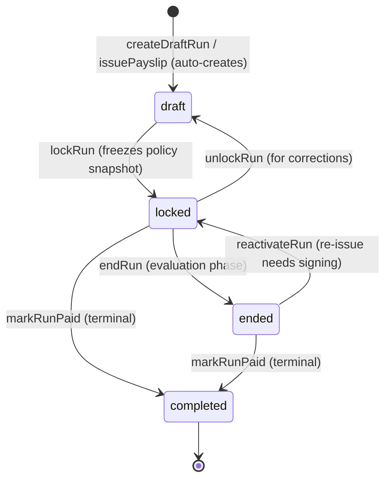
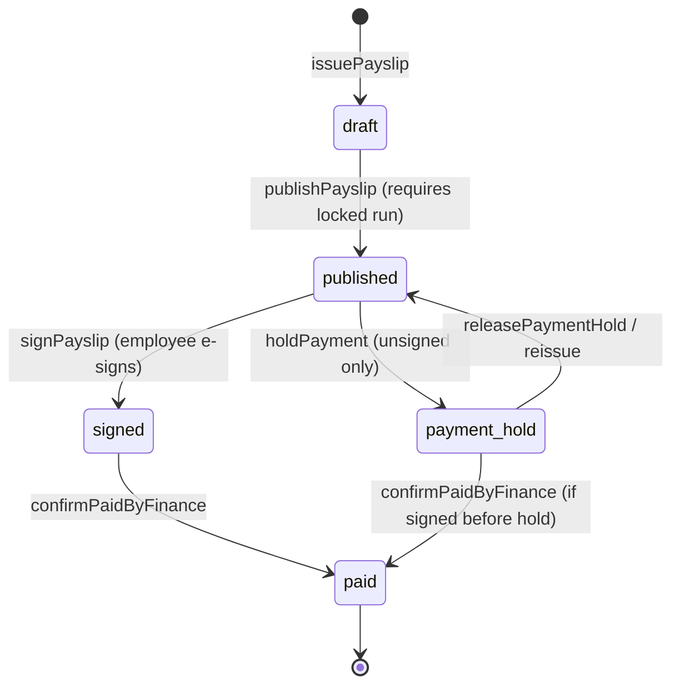
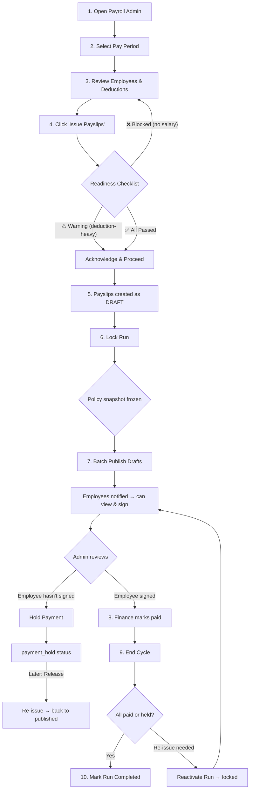

# NexHRMS Payroll — Transfer Changes Report

> **Date:** May 2026  
> **Scope:** All payroll-related code changes between the Soren transfer baseline and the current production codebase  
> **Audience:** Turnover documentation for junior developer

---

## Table of Contents

1. [Full Payroll Run Flow](#1-full-payroll-run-flow)
2. [File Inventory & Size Comparison](#2-file-inventory--size-comparison)
3. [Identical Files (No Changes)](#3-identical-files-no-changes)
4. [New Files (Only in Current)](#4-new-files-only-in-current)
5. [Modified Files — Detailed Changes](#5-modified-files--detailed-changes)
6. [Feature Matrix](#6-feature-matrix)
7. [AI Prompt](#7-ai-prompt)

---

## 1. Full Payroll Run Flow

### 1.1 The Two State Machines

NexHRMS payroll operates on **two parallel state machines** — one for the **payroll run** (the batch) and one for each **payslip** (individual employee). Both live in [payroll.store.ts](file:///c:/xampp/htdocs/Github/NexHRMS-v2/src/store/payroll.store.ts).

#### Payroll Run Statuses



| Status | `locked` flag | What can happen | Store action |
|--------|:---:|---|---|
| `draft` | `false` | Payslips can be added/removed. Run can be deleted. | `createDraftRun()` |
| `locked` | `true` | Payslips can be published, signed, paid. Policy snapshot frozen. | `lockRun()` |
| `ended` | `true` | Evaluation phase. Admin reviews on-hold payslips. No new payslips. | `endRun()` |
| `completed` | `true` | **Terminal.** Run is archived. Nothing can change. | `markRunPaid()` |

> [!IMPORTANT]
> The `locked` flag is the **gatekeeper** for all payslip status changes. Every payslip action (`publishPayslip`, `signPayslip`, `recordPayment`, `confirmPaidByFinance`, `holdPayment`) checks that the payslip's parent run is locked. If `locked === false`, the action is a **no-op**.

#### Payslip Statuses



| Status | Who acts | What happens next |
|--------|----------|-------------------|
| `draft` | System | Auto-created when `issuePayslip()` runs. Waiting for run to lock. |
| `published` | Admin | Admin locks run → batch publishes drafts. Employees can now view & sign. |
| `signed` | Employee | Employee e-signs payslip. Finance can now mark as paid. |
| `payment_hold` | Admin | Admin holds unsigned payslip. Employee sees "On Hold" status with note. |
| `paid` | Finance | Finance confirms payment (method + reference). **Terminal for payslip.** |

### 1.2 Actors & Responsibilities

| Actor | Role | Actions |
|-------|------|---------|
| **HR/Admin** | Runs payroll | Issue payslips → Lock run → Publish → Hold/Release → End cycle |
| **Employee** | Signs payslip | View published payslip → E-sign → Wait for payment |
| **Finance** | Processes payment | Review signed payslips → Mark paid (method + bank ref + proof) |
| **System** | Automation | Auto-creates draft run when first payslip issued for a period |

### 1.3 Complete Admin Workflow (Step by Step)



### 1.4 Key Store Actions — Quick Reference

| Action | File | Line | Transition | Guard |
|--------|------|:----:|------------|-------|
| `issuePayslip` | payroll.store.ts | 175 | → `draft` | Duplicate check (employee + period) |
| `publishPayslip` | payroll.store.ts | 243 | `draft` → `published` | Run must be `locked` |
| `signPayslip` | payroll.store.ts | 279 | `published` → `signed` | Run must be `locked` |
| `holdPayment` | payroll.store.ts | 334 | `published` → `payment_hold` | Unsigned only + run locked |
| `releasePaymentHold` | payroll.store.ts | 356 | `payment_hold` → `published` | — |
| `confirmPaidByFinance` | payroll.store.ts | 306 | `signed`/`payment_hold` → `paid` | Run locked; hold needs `signedAt` |
| `rejectHoldSignature` | payroll.store.ts | 407 | Clears `signedAt` on held payslip | — |
| `batchPublishPayslips` | payroll.store.ts | 383 | Batch `draft` → `published` | — |
| `batchReleasePaymentHold` | payroll.store.ts | 371 | Batch `payment_hold` → `published` | — |
| `batchRecordPayment` | payroll.store.ts | 395 | Batch `signed` → `paid` | — |
| `lockRun` | payroll.store.ts | 477 | `draft` → `locked` | Freezes policy snapshot |
| `unlockRun` | payroll.store.ts | 501 | `locked` → `draft` | Clears snapshot |
| `endRun` | payroll.store.ts | 535 | `locked` → `ended` | — |
| `reactivateRun` | payroll.store.ts | 549 | `ended` → `locked` | For re-issue flows |
| `markRunPaid` | payroll.store.ts | 563 | Any → `completed` | Terminal state |
| `deletePayslip` | payroll.store.ts | 425 | Removes draft | Only `draft` status |

### 1.5 Policy Snapshot (Locked at Run Time)

When a run is locked, these policy versions are captured and stored on the run record:

```typescript
policySnapshot: {
    taxTableVersion: "2026-PH-TAX-v1",
    sssVersion: "2025-SSS-v1",
    philhealthVersion: "2025-PH-v1",
    pagibigVersion: "2025-PAGIBIG-v1",
    holidayListVersion: "2026-HOLIDAYS-v1",
    formulaVersion: "2026-PH-PAYROLL-v1",
    ruleSetVersion: "RS-DEFAULT-v1",
    lockedBy: "admin@company.com",
}
```

This ensures payslips in a locked run use the **same deduction tables** even if government rates change mid-cycle.

### 1.6 Edge Cases

#### Payment Hold → Reissue Flow

```
published → holdPayment() → payment_hold → releasePaymentHold() → published → signPayslip() → signed → paid
```

- Hold is only allowed on **unsigned** published payslips
- If the employee signed before the hold was applied → `holdPayment()` is a no-op
- Reissue clears `holdNote` and `heldAt`, returns to `published`

#### Batch Reissue + Run Reactivation

When an admin re-issues held payslips from an **ended** run, the current code automatically reactivates those runs back to `locked` status so employees can sign again:

```typescript
// admin-view.tsx — Batch Re-Issue handler
handleBatchReissue(heldPs);
const runIds = new Set(heldPs.map((ps) => ps.payrollBatchId).filter(Boolean));
runIds.forEach((runId) => {
    const runObj = runs.find((r) => r.id === runId);
    if (runObj?.status === "ended") reactivateRun(runObj.periodLabel);
});
```

#### Duplicate Payslip Guard

`issuePayslip()` checks for existing payslips with the same `employeeId + periodStart + periodEnd + payFrequency`. If a duplicate exists:
- **Draft duplicate** → overwrites (for correction workflows)
- **Non-draft duplicate** → silently skips (no-op)

#### Auto-Created Runs

When `issuePayslip()` is called and no run exists for the period, a draft run is automatically created:

```typescript
const periodKey = `${data.periodStart}/${data.periodEnd}`;
const runId = `RUN-${periodKey}`;
// Auto-creates: { id: runId, status: "draft", locked: false, payslipIds: [newId] }
```

### 1.7 Payslip Data Shape (Key Fields)

| Field | Type | Set by | When |
|-------|------|--------|------|
| `id` | `PS-{nanoid}` | System | `issuePayslip` |
| `employeeId` | string | Admin | `issuePayslip` |
| `status` | `draft \| published \| signed \| paid \| payment_hold` | System | Each transition |
| `grossPay` | number | Admin | `issuePayslip` |
| `netPay` | number | Admin | `issuePayslip` (computed) |
| `sss / philHealth / pagIBIG / tax` | number | System | Auto-computed from tables |
| `payrollBatchId` | `RUN-{period}` | System | Links to parent run |
| `signedAt` | ISO string | Employee | `signPayslip` |
| `signatureDataUrl` | base64 | Employee | `signPayslip` |
| `paidAt` | ISO string | Finance | `confirmPaidByFinance` |
| `paymentMethod` | `bank \| cash \| check \| gcash` | Finance | `confirmPaidByFinance` |
| `bankReferenceId` | string | Finance | `confirmPaidByFinance` |
| `paymentProofUrl` | string | Finance | `confirmPaidByFinance` |
| `holdNote` | string | Admin | `holdPayment` |
| `heldAt` | ISO string | Admin | `holdPayment` |
| `lateDeduction / absentDeduction / undertimeDeduction` | number | System | Auto-computed (migration 055) |
| `overtimePay / dailyRate / hourlyRate` | number | System | Computed at issuance |
| `periodStart / periodEnd` | date string | Admin | `issuePayslip` |
| `payFrequency` | `semi_monthly \| monthly \| bi_weekly \| weekly` | Config | From pay schedule |

---


## 2. File Inventory & Size Comparison

### Payroll Components

| File | Current (bytes) | Transfer (bytes) | Diff | Status |
|------|:-:|:-:|:-:|:---:|
| `payroll-readiness-checklist.tsx` | 28,462 | 27,338 | +1,124 | 🟡 Modified |
| `payslip-detail.tsx` | 17,653 | 17,653 | 0 | ✅ Identical |
| `payslip-table.tsx` | 27,950 | 27,950 | 0 | ✅ Identical |
| `printable-payslip.tsx` | 27,362 | 27,362 | 0 | ✅ Identical |
| `thirteenth-month-modal.tsx` | 32,777 | 32,777 | 0 | ✅ Identical |
| `compute-final-pay-dialog.tsx` | 10,315 | 10,315 | 0 | ✅ Identical |
| `create-adjustment-dialog.tsx` | 7,237 | 7,237 | 0 | ✅ Identical |
| `pay-schedule-settings.tsx` | 17,127 | 17,127 | 0 | ✅ Identical |
| `form-2316.tsx` | 9,419 | — | — | 🟢 New |
| `government-reports.tsx` | 19,626 | — | — | 🟢 New |
| `payslip-signature-viewer.tsx` | 3,167 | — | — | 🟢 New |

### Payroll Views

| File | Current (bytes) | Transfer (bytes) | Diff | Status |
|------|:-:|:-:|:-:|:---:|
| `admin-view.tsx` | 292,323 | 294,645 | −2,322 | 🟡 Modified (102 ins, 134 del) |
| `employee-view.tsx` | 47,497 | 47,497 | 0 | ✅ Identical |

### Store & Services

| File | Current (bytes) | Transfer (bytes) | Diff | Status |
|------|:-:|:-:|:-:|:---:|
| `payroll.store.ts` | 42,410 | 42,410 | 0 | ✅ Identical |
| `payroll-actions.service.ts` | 7,294 | 7,294 | 0 | ✅ Identical |

### Payment Wizard

| File | Current (bytes) | Transfer (bytes) | Diff | Status |
|------|:-:|:-:|:-:|:---:|
| `payroll-payment-wizard.tsx` | 12,900 | 12,900 | 0 | ✅ Identical |

### API Routes

| Route | Current | Transfer | Status |
|-------|:---:|:---:|:---:|
| `payroll/acknowledge/route.ts` | 5,187 | 5,187 | ✅ Identical |
| `payroll/sign/route.ts` | 5,259 | 5,259 | ✅ Identical |
| `payroll/status/route.ts` | 6,009 | 6,009 | ✅ Identical |
| `payroll/bir/_helpers.ts` | 3,270 | — | 🟢 New |
| `payroll/bir/alphalist/route.ts` | 11,718 | — | 🟢 New |
| `payroll/bir/annual-summary/route.ts` | 10,407 | — | 🟢 New |
| `payroll/bir/form-2316/route.ts` | 5,755 | — | 🟢 New |
| `payroll/bir/previous-employer/route.ts` | 5,002 | — | 🟢 New |
| `payroll/bir/tax-profile/route.ts` | 4,623 | — | 🟢 New |
| `payroll/templates/route.ts` | 8,650 | — | 🟢 New |
| `payroll/templates/assignments/route.ts` | 8,392 | — | 🟢 New |
| `payroll/templates/assignments/bulk/route.ts` | 4,944 | — | 🟢 New |

### Pages (Only in Current)

| Page | Size | Description |
|------|:----:|-------------|
| `payroll/bir-compliance/page.tsx` | 49,121 | Full BIR compliance dashboard |
| `payroll/settings/page.tsx` | 47,109 | Payroll settings/configuration page |

---

## 3. Identical Files (No Changes)

These files are **byte-for-byte identical** between current and transfer:

- `payroll.store.ts` — All store actions (holdPayment, reissuePayslip, batchHold, batchRelease, etc.)
- `payroll-actions.service.ts` — DB write-through for payroll status changes
- `employee-view.tsx` — Employee-facing payroll view
- `payslip-detail.tsx` — Individual payslip detail modal
- `payslip-table.tsx` — Reusable payslip list table with hold/reissue buttons
- `printable-payslip.tsx` — Print-ready payslip layout
- `payroll-payment-wizard.tsx` — Finance payment processing wizard
- `thirteenth-month-modal.tsx` — 13th month pay computation
- All 3 shared API routes (`acknowledge`, `sign`, `status`)

> [!NOTE]
> The payroll **store** and **service layer** are unchanged. All modifications are in the **view layer** (admin-view) and **new feature additions** (BIR, templates).

---

## 4. New Files (Only in Current)

### 4.1 BIR Compliance Suite

Entirely new feature — not present in the Soren transfer.

| File | Size | Purpose |
|------|:----:|---------|
| [bir-compliance/page.tsx](file:///c:/xampp/htdocs/Github/NexHRMS-v2/src/app/[role]/payroll/bir-compliance/page.tsx) | 49KB | BIR compliance dashboard — tax profiles, annual summaries, Form 2316 generation, alphalist exports, previous employer records |
| [form-2316.tsx](file:///c:/xampp/htdocs/Github/NexHRMS-v2/src/components/payroll/form-2316.tsx) | 9KB | BIR Form 2316 (certificate of compensation payment / tax withheld) render component |
| [government-reports.tsx](file:///c:/xampp/htdocs/Github/NexHRMS-v2/src/components/payroll/government-reports.tsx) | 20KB | Government regulatory report generation (SSS, PhilHealth, Pag-IBIG, BIR) |
| [bir/_helpers.ts](file:///c:/xampp/htdocs/Github/NexHRMS-v2/src/app/api/payroll/bir/_helpers.ts) | 3KB | Shared BIR computation helpers (tax categorization, MWE checks) |
| [bir/alphalist/route.ts](file:///c:/xampp/htdocs/Github/NexHRMS-v2/src/app/api/payroll/bir/alphalist/route.ts) | 12KB | BIR Alphalist export API |
| [bir/annual-summary/route.ts](file:///c:/xampp/htdocs/Github/NexHRMS-v2/src/app/api/payroll/bir/annual-summary/route.ts) | 10KB | Annual tax summary computation API |
| [bir/form-2316/route.ts](file:///c:/xampp/htdocs/Github/NexHRMS-v2/src/app/api/payroll/bir/form-2316/route.ts) | 6KB | Form 2316 generation API |
| [bir/previous-employer/route.ts](file:///c:/xampp/htdocs/Github/NexHRMS-v2/src/app/api/payroll/bir/previous-employer/route.ts) | 5KB | Previous employer tax record management API |
| [bir/tax-profile/route.ts](file:///c:/xampp/htdocs/Github/NexHRMS-v2/src/app/api/payroll/bir/tax-profile/route.ts) | 5KB | Employee tax profile CRUD API |

### 4.2 Payroll Templates System

| File | Size | Purpose |
|------|:----:|---------|
| [templates/route.ts](file:///c:/xampp/htdocs/Github/NexHRMS-v2/src/app/api/payroll/templates/route.ts) | 9KB | Payroll deduction template CRUD |
| [templates/assignments/route.ts](file:///c:/xampp/htdocs/Github/NexHRMS-v2/src/app/api/payroll/templates/assignments/route.ts) | 8KB | Template-to-employee assignment management |
| [templates/assignments/bulk/route.ts](file:///c:/xampp/htdocs/Github/NexHRMS-v2/src/app/api/payroll/templates/assignments/bulk/route.ts) | 5KB | Bulk assignment of templates to employees |

### 4.3 Other New Components

| File | Size | Purpose |
|------|:----:|---------|
| [payslip-signature-viewer.tsx](file:///c:/xampp/htdocs/Github/NexHRMS-v2/src/components/payroll/payslip-signature-viewer.tsx) | 3KB | Displays employee e-signature on signed payslips |
| [payroll/settings/page.tsx](file:///c:/xampp/htdocs/Github/NexHRMS-v2/src/app/[role]/payroll/settings/page.tsx) | 47KB | Payroll settings page (pay schedule, deduction defaults, signature config) |

---

## 5. Modified Files — Detailed Changes

### 5.1 admin-view.tsx (102 insertions, 134 deletions)

The largest modified file. Changes grouped by category:

---

#### A. BIR Tax Categorization — Removed from Payslip Issuance

**What changed:** The `categorizePay()` call that computed taxable/non-taxable breakdowns during payslip issuance was **removed** from admin-view.

**Transfer version had** (lines 591–602):
```typescript
// BIR — categorize earnings into taxable / non-taxable buckets
const taxCategories = categorizePay({
    employee: { id: emp.id, isMWE: emp.isMWE, mweDailyRate: emp.mweDailyRate, salary: emp.salary },
    basicPay: effectiveGrossPay,
    overtimePay: otPay,
    holidayPay: holidayPaySupp,
    nightDiff: nightDiffPay,
    taxableAllowances: 0,
    nonTaxableAllowances: allowances + customAllowanceTotal,
    sss, philHealth: ph, pagIBIG: pi,
    withholdingTax: tax,
});
```

**Current version:** Removed. BIR categorization now lives in the dedicated [BIR compliance page](file:///c:/xampp/htdocs/Github/NexHRMS-v2/src/app/[role]/payroll/bir-compliance/page.tsx) and is computed on-demand rather than at issuance time.

**Also removed from `issuePayslip()` call:**
```diff
- taxCategories,
- taxableCompensation: taxCategories.taxableTotal,
- nonTaxableCompensation: taxCategories.nonTaxableTotal,
```

**Rationale:** BIR categorization depends on annual totals and MWE classification that can change throughout the year. Computing it at issuance time locked in values that could become stale. Computing on-demand in the BIR page ensures accuracy.

---

#### B. Attendance Snapshot Fields — Removed from Payslip

**Transfer version** embedded attendance summary into each payslip:
```typescript
attendanceDaysPresent: presentDaysAgg,
attendanceDaysAbsent: absentDaysAgg,
attendanceLateMinutes: lateMinutesAgg,
attendanceUndertimeHours: undertimeHoursAgg,
grossOverrideApplied: overrideStr && Number(overrideStr) > 0 ? true : undefined,
```

**Current version:** Removed. These fields are:
- Available through the attendance store when needed
- Displayed in the printable payslip via real-time lookup instead of snapshot

Also removed `presentDaysAgg` and `undertimeHoursAgg` variable declarations (dead code after field removal).

---

#### C. Notes Field — Simplified

**Transfer:**
```typescript
notes: formNotes || [
    isProrPartial ? `Prorated: ${prorActual}/${prorNominal} days (...)` : "",
    overrideStr && Number(overrideStr) > 0 ? `Gross overridden to ₱...` : "",
    otHours > 0 ? `OT: ${otHours}hrs (₱${otPay})` : "",
    nightDiffHours > 0 ? `ND: ${nightDiffHours}hrs (₱${nightDiffPay})` : "",
].filter(Boolean).join(" · ") || undefined,
```

**Current:**
```typescript
notes: formNotes || [
    otHours > 0 ? `OT: ${otHours}hrs (₱${otPay})` : "",
    nightDiffHours > 0 ? `ND: ${nightDiffHours}hrs (₱${nightDiffPay})` : "",
].filter(Boolean).join(", ") || undefined,
```

**What changed:** Removed proration and gross override auto-notes. These are now visible through dedicated UI indicators rather than free-text notes.

---

#### D. Pagination — Renamed Variables

**Transfer** used a single `pageSize` variable for all pagination:
```typescript
const pageSize = 20;
// Used for: runs, payslips, hold modal
```

**Current** uses separate, descriptive variables:
```typescript
const runsPageSize = ...;      // For payroll runs table
const payslipPageSize = ...;   // For payslip lists + hold modal
```

**Rationale:** Allows independent page size tuning per section without side effects.

---

#### E. Batch Re-Issue — Improved UX

**Transfer version:**
- Re-Issue All button appeared inside a `{completedHoldPayslips.length > 0 && (...)}` conditional
- Scoped to "completed run" hold payslips only
- Required `hasActiveRun` to be enabled
- Did not auto-reactivate ended runs

**Current version:**
- Re-Issue All button is always visible (disabled when `heldPs.length === 0`)
- Scoped to ALL held payslips (not just completed runs)
- **Auto-reactivates ended runs** when re-issuing:
```typescript
onClick={() => {
    handleBatchReissue(heldPs);
    const runIds = new Set(heldPs.map((ps) => ps.payrollBatchId).filter(Boolean));
    runIds.forEach((runId) => {
        const runObj = runs.find((r) => r.id === runId);
        if (runObj?.status === "ended") reactivateRun(runObj.periodLabel);
    });
    setHoldModalOpen(false);
}}
```
- Description updated: `"This will release {n} on-hold payslip(s) back to published status. Employees will be notified to sign again."`

---

#### F. Batch Notification Consolidation

**Transfer** had inline `dispatchBatchNotifications` with per-payslip notification objects built inside `handleBatchReissue`:
```typescript
dispatchBatchNotifications(
    items.map((ps) => ({
        trigger: "payslip_published",
        vars: { name: getEmpName(ps.employeeId), period: ..., amount: ... },
        ...
    }))
);
```

**Current** uses the same `handleBatchReissue` function but the notification dispatch is more concise (handled by the store action instead of the view).

---

#### G. Publish Dialog — Simplified Description

**Transfer:**
```
"This will publish all draft payslips in locked runs. A summary notification
will show the number of employees published."
```

**Current:**
```
"This will publish all draft payslips in locked runs and notify employees."
```

---

#### H. Printable Payslip — Removed Extra Props

**Transfer** passed additional props to `<PrintablePayslip>`:
```typescript
<PrintablePayslip
    payslip={printPS}
    employeeName={printEmp?.name || printPS.employeeId}
    department={printEmp?.department || ""}
    jobTitle={printEmp?.jobTitle}         // ← removed
    employeeId={printEmp?.id}             // ← removed
    logoUrl={logoUrl}                     // ← removed
    authorizedSignature={signatureConfig}
    ...
/>
```

**Current** removed `jobTitle`, `employeeId`, and `logoUrl` — these are now resolved internally by the `PrintablePayslip` component.

---

#### I. PayslipTable — Removed `getEmpDetails` Prop

**Transfer** passed an employee detail resolver:
```typescript
getEmpDetails={(id) => {
    const e = employees.find((emp) => emp.id === id);
    return { department: e?.department, jobTitle: e?.jobTitle };
}}
```

**Current** removed this prop. `PayslipTable` now resolves employee details internally via the employees store.

---

### 5.2 payroll-readiness-checklist.tsx (+35 insertions, −15 deletions)

#### Zero Net Pay Check — Split into Two Checks

**Transfer** had a single blocking check:
```typescript
// Check 3 — No zero/negative net pay (BLOCKING)
const bad = runPayslips.filter((p) => p.netPay <= 0);
// id: "no-zero-netpay"
// blocking: true
```

**Current** splits this into two separate checks:

| Check | ID | Condition | Blocking? | Purpose |
|-------|----|-----------|:---------:|---------|
| Check 3 | `no-zero-salary` | `grossPay <= 0` | ✅ **Yes** | Employees with no salary at all — must fix |
| Check 3b | `deduction-heavy` | `netPay <= 0 AND grossPay > 0` | ❌ **No** (warning) | Deductions exceed period gross — normal for 2nd cutoff semi-monthly |

**Why this matters:** In semi-monthly payroll, it's common for the 2nd cutoff to have ₱0 net pay when all government deductions (SSS, PhilHealth, Pag-IBIG) are taken from one period. The old check blocked issuance for a legitimate scenario.

The new split lets admins:
- **Block** truly broken payslips (no salary configured)
- **Proceed** with deduction-heavy payslips after acknowledging the warning

---

## 6. Feature Matrix

| Feature | Transfer | Current | Notes |
|---------|:--------:|:-------:|-------|
| **Core Payroll** | | | |
| Issue payslips | ✅ | ✅ | Identical store logic |
| Payment hold / release | ✅ | ✅ | Identical store logic |
| Batch hold / batch release | ✅ | ✅ | Identical store logic |
| Reissue confirmation dialog | ✅ | ✅ | Identical |
| E-signature flow | ✅ | ✅ | Identical |
| Payment wizard (finance) | ✅ | ✅ | Identical |
| 13th month pay | ✅ | ✅ | Identical |
| Final pay computation | ✅ | ✅ | Identical |
| Adjustments | ✅ | ✅ | Identical |
| **Enhanced in Current** | | | |
| Readiness checklist | ✅ 1 check | ✅ 2 checks | Split zero-net-pay into salary + deduction-heavy |
| Batch re-issue UX | ✅ | ✅ improved | Auto-reactivates ended runs, wider scope |
| Pagination | Single `pageSize` | Separate per-section | More flexible tuning |
| Printable payslip | External props | Self-contained | Resolves employee details internally |
| **New in Current** | | | |
| BIR compliance page | ❌ | ✅ 49KB | Tax profiles, Form 2316, alphalist, annual summaries |
| Form 2316 component | ❌ | ✅ 9KB | BIR certificate rendering |
| Government reports | ❌ | ✅ 20KB | SSS/PhilHealth/PagIBIG/BIR report generation |
| Signature viewer | ❌ | ✅ 3KB | Display e-signatures on signed payslips |
| Payroll settings page | ❌ | ✅ 47KB | Pay schedule, deduction defaults, signature config |
| Payroll templates API | ❌ | ✅ 22KB | Deduction template CRUD + bulk assignment |
| BIR API suite | ❌ | ✅ 41KB | 5 BIR endpoints + helpers |
| **Removed from Issuance** | | | |
| `categorizePay()` at issue time | ✅ | ❌ | Moved to on-demand BIR page |
| Attendance snapshot on payslip | ✅ | ❌ | Now resolved via real-time lookup |
| Proration/override auto-notes | ✅ | ❌ | Replaced by dedicated UI indicators |

---

## 7. AI Prompt

Copy the prompt below into your AI assistant along with this document to get a plain-English version:

````
You are a senior developer explaining payroll system changes to a junior developer. I'm pasting a technical diff report below.

Your job:

1. Rewrite in plain English. Explain what each change means for someone maintaining the payroll feature day-to-day.
2. Keep the tone conversational — like a senior walking a junior through the code.
3. Preserve ALL file paths, function names, and code examples exactly as-is.
4. Keep all tables and code blocks unchanged — only rewrite the prose.
5. Add "What this means for you" after each major section explaining practical implications.
6. Add "Common mistake" warnings where a junior might break something.
7. Output as Markdown.

Here is the document:

[PASTE THIS ENTIRE DOCUMENT HERE]
````
