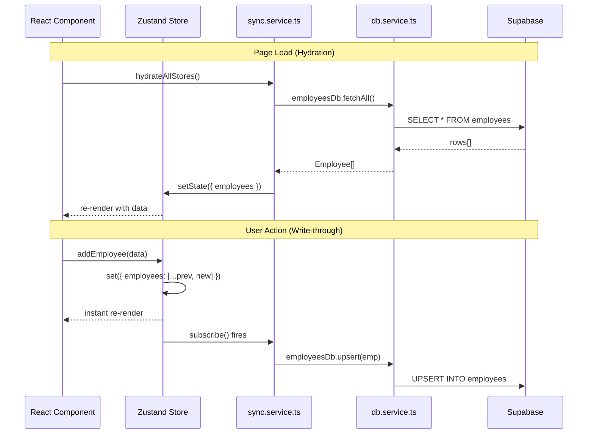

# NexHRMS State Management — Turnover Document

> **Author:** Senior Developer Handoff  
> **Date:** May 2026  
> **Audience:** Junior developer inheriting the codebase

---

## Table of Contents

1. [Architecture Overview](#1-architecture-overview)
2. [What We Built (Zustand + Supabase Sync)](#2-what-we-built)
3. [All Optimizations Made](#3-all-optimizations-made)
4. [Known Pain Points & Technical Debt](#4-known-pain-points--technical-debt)
5. [Future: React Query Migration Guide](#5-future-react-query-migration-guide)
6. [Module-by-Module Migration Checklist](#6-module-by-module-migration-checklist)
7. [Quick Reference: File Map](#7-quick-reference-file-map)

---

## 1. Architecture Overview

### Current Architecture (Zustand + Supabase)

```
┌─────────────┐     ┌──────────────────┐     ┌──────────────┐     ┌───────────┐
│  React UI   │────▶│  Zustand Store   │────▶│ sync.service │────▶│ Supabase  │
│ Components  │◀────│  (in-memory)     │◀────│  (bridge)    │◀────│ (Postgres)│
└─────────────┘     └──────────────────┘     └──────────────┘     └───────────┘
                           │                        │
                    setState() for               2 jobs:
                    instant UI updates        1. Hydration (DB → Store)
                                              2. Write-through (Store → DB)
```

### How Data Flows



### Three-Layer Pattern

| Layer | File | Responsibility |
|-------|------|----------------|
| **Store** | `src/store/*.store.ts` | In-memory state + actions (add, update, delete) |
| **Sync** | `src/services/sync.service.ts` | Hydration (DB→Store) + Write-through (Store→DB) |
| **DB** | `src/services/db.service.ts` | Raw Supabase CRUD (fetchAll, upsert, remove) |

---

## 2. What We Built

### 2.1 db.service.ts — Generic Supabase CRUD

Located at [db.service.ts](file:///c:/xampp/htdocs/Github/NexHRMS-v2/src/services/db.service.ts)

Every table follows the same pattern:

```typescript
// Generic helpers (defined once)
async function fetchAll<T>(table: string): Promise<T[]> {
  const { data, error } = await supabase.from(table).select("*");
  if (error) throw error;
  return (data ?? []) as T[];
}

async function upsertRow(table: string, row: Record<string, unknown>): Promise<boolean> {
  const { error } = await supabase.from(table).upsert(row, { onConflict: "id" });
  return !error;
}

async function deleteRow(table: string, id: string): Promise<boolean> {
  const { error } = await supabase.from(table).delete().eq("id", id);
  return !error;
}

// Per-table exports
export const employeesDb = {
  fetchAll: () => fetchAll<Employee>("employees"),
  upsert: (emp: Employee) => upsertRow("employees", emp),
  remove: (id: string) => deleteRow("employees", id),
};
```

**Tables wired in db.service.ts:**

| DB Object | Supabase Table | Migration |
|-----------|---------------|-----------|
| `employeesDb` | `employees` | 002/003 |
| `salaryDb` | `salary_change_requests`, `salary_history` | 002 |
| `attendanceDb` | `attendance_logs` | 004 |
| `attendanceEventsDb` | `attendance_events` | 004 |
| `attendanceExceptionsDb` | `attendance_exceptions` | 004 |
| `overtimeDb` | `overtime_requests` | 004 |
| `shiftDb` | `shift_templates`, `employee_shifts` | 002/004 |
| `leaveDb` | `leave_requests`, `leave_balances`, `leave_policies` | 005 |
| `payrollDb` | `payroll_runs`, `payslips` | 006 |
| `loansDb` | `loans` | 007 |
| `tasksDb` | `tasks`, `task_groups`, `task_completion_reports`, `task_comments`, `task_tags` | 008/032 |
| `messagingDb` | `announcements`, `text_channels`, `channel_messages` | 008/046 |
| `auditDb` | `audit_logs` | 009 |
| `eventsDb` | `calendar_events` | 002 |
| `notificationsDb` | `notification_logs` | 009 |
| `departmentsDb` | `departments` | 035 |
| `jobTitlesDb` | `job_titles` | 034 |
| `holidaysDb` | `holidays` | 002 |
| `projectsDb` | `projects` | 010 |
| `penaltiesDb` | `penalty_records` | 004 |
| `disciplinaryDb` | `disciplinary_cases`, `nte_records`, `nod_records` | 057 |
| `documentsDb` | `employee_201_documents` | 057 |
| `performanceDb` | `performance_cycles`, `performance_criteria`, etc. | 025 |
| `birDb` | `employee_tax_profiles`, `annual_tax_summaries`, etc. | 056 |

### 2.2 sync.service.ts — The Bridge

Located at [sync.service.ts](file:///c:/xampp/htdocs/Github/NexHRMS-v2/src/services/sync.service.ts) (~2000 lines)

**Key exports:**

```typescript
// Called on login / page refresh
export async function hydrateAllStores(opts?: { skipSessionCheck?: boolean }): Promise<void>;

// Called after hydration completes
export function startWriteThrough(): void;

// Called on logout
export function stopWriteThrough(): void;

// Force re-pull from Supabase
export async function forceRehydrate(): Promise<void>;

// Supabase Realtime subscriptions
export function startRealtime(): void;
export function stopRealtime(): void;
```

**Hydration flow** (inside `hydrateAllStoresInternal`):

```typescript
// 1. Guard: skip if demo mode or already hydrated
if (!shouldSync()) return;
if (_hydrated) return;

// 2. Clear stale localStorage from old persist() stores
clearStaleStorage();

// 3. Check for valid Supabase session
const hasSession = await hasValidSession();
if (!hasSession) return;

// 4. Pause write-through to prevent feedback loop
_writePaused = true;

// 5. Fetch everything from Supabase in parallel batches
const [employees, salaryRequests, ...] = await Promise.allSettled([
  employeesDb.fetchAll(),
  salaryDb.fetchRequests(),
  ...
]);

// 6. Push data into Zustand stores
useEmployeesStore.setState({ employees, salaryRequests, salaryHistory });
useLeaveStore.setState({ requests, balances, policies });
// ... all stores ...

// 7. Resume write-through
_writePaused = false;
_hydrated = true;
```

**Write-through flow** (inside `subscribeAllStores`):

```typescript
useEmployeesStore.subscribe((state, prevState) => {
  if (_writePaused) return;

  // Detect new/changed employees
  for (const emp of state.employees) {
    const prev = prevState.employees.find(e => e.id === emp.id);
    if (!prev || JSON.stringify(prev) !== JSON.stringify(emp)) {
      employeesDb.upsert(emp);  // fire-and-forget
    }
  }

  // Detect deletions
  for (const prev of prevState.employees) {
    if (!state.employees.find(e => e.id === prev.id)) {
      employeesDb.remove(prev.id);
    }
  }
});
```

### 2.3 Call Site — client-layout.tsx

Located at [client-layout.tsx](file:///c:/xampp/htdocs/Github/NexHRMS-v2/src/app/client-layout.tsx)

```typescript
// On authenticated mount:
safeGetSession(supabase).then((session) => {
  if (!session) { handleInvalidSession(); return; }
  
  hydrateAllStores({ skipSessionCheck: true }).then(() => {
    startWriteThrough();  // Subscribe to store changes
    startRealtime();       // Subscribe to Supabase Realtime
  });
});
```

---

## 3. All Optimizations Made

### 3.1 Removed `persist()` Middleware

**Problem:** Several stores used Zustand's `persist()` middleware which saved state to `localStorage`. After moving to Supabase, this created **two sources of truth** — localStorage and Supabase would fight.

**Fix:** Removed `persist()` + `safePersistStorage` from:
- `disciplinary.store.ts`
- `documents.store.ts`
- `performance.store.ts`
- `bir-compliance.store.ts`

**Why these 4:** They were the only stores still using `persist()` after the Supabase migration. Stores like `auth.store.ts` and `appearance.store.ts` intentionally keep `persist()` because they need offline access.

### 3.2 Nuclear Cache Clearing

**Problem:** Even after removing `persist()`, stale `localStorage` keys from previous sessions remained and could rehydrate zombie data on page load.

**Fix:** Created [clear-stale-storage.ts](file:///c:/xampp/htdocs/Github/NexHRMS-v2/src/lib/clear-stale-storage.ts):

```typescript
export function clearStaleStorage() {
  const STALE_PREFIXES = ["soren-", "nexhrms-", "hrms-"];
  const KEEP_KEYS = new Set(["soren-auth", "soren-appearance", "soren-kiosk"]);
  
  for (let i = localStorage.length - 1; i >= 0; i--) {
    const key = localStorage.key(i);
    if (!key) continue;
    if (KEEP_KEYS.has(key)) continue;
    if (STALE_PREFIXES.some(p => key.startsWith(p))) {
      localStorage.removeItem(key);
    }
  }
}
```

Called automatically at the start of `hydrateAllStoresInternal()`.

### 3.3 Conditional Seed Data Initialization

**Problem:** All 10 Zustand stores initialized with hardcoded `SEED_*` data (fake employees, fake attendance, etc.). In production with Supabase, if hydration failed or was delayed, users saw **seed data mixed with real data** — e.g., 81 seed employees + 32 real employees = 113 phantom employees.

**Fix:** Added `USE_DEMO_MODE` guard to all 10 stores:

```typescript
const USE_DEMO_MODE = typeof process !== "undefined" 
  && process.env?.NEXT_PUBLIC_USE_DEMO_MODE === "true";

export const useEmployeesStore = create<EmployeesState>()(
  (set, get) => ({
    employees: USE_DEMO_MODE ? SEED_EMPLOYEES : [],  // ← was: SEED_EMPLOYEES
    // ...
  })
);
```

**Stores fixed:**

| Store | Seed Constants |
|-------|---------------|
| `employees.store.ts` | `SEED_EMPLOYEES` |
| `attendance.store.ts` | `SEED_ATTENDANCE` |
| `leave.store.ts` | `SEED_LEAVES` |
| `loans.store.ts` | `SEED_LOANS` |
| `events.store.ts` | `SEED_EVENTS` |
| `projects.store.ts` | `SEED_PROJECTS` |
| `messaging.store.ts` | `SEED_ANNOUNCEMENTS`, `SEED_TEXT_CHANNELS`, `SEED_CHANNEL_MESSAGES` |
| `tasks.store.ts` | `SEED_TASK_GROUPS`, `SEED_TASKS`, `SEED_COMPLETION_REPORTS`, `SEED_TASK_COMMENTS`, `SEED_TASK_TAGS` |
| `departments.store.ts` | `SEED_DEPARTMENTS` |
| `job-titles.store.ts` | `SEED_JOB_TITLES` |

> [!NOTE]
> `resetToSeed()` functions were intentionally left unchanged — they're manual admin actions for resetting to demo state.

### 3.4 Hydration Setters

**Problem:** Some stores had no setter functions, making it impossible for `sync.service.ts` to push Supabase data into them.

**Fix:** Added manual setters:

```typescript
// disciplinary.store.ts
setCases: (c: DisciplinaryCase[]) => set({ cases: c }),
setNTEs: (n: NTERecord[]) => set({ ntes: n }),
setNODs: (n: NODRecord[]) => set({ nods: n }),

// documents.store.ts
setDocuments: (d: Employee201Document[]) => set({ documents: d }),
```

### 3.5 Write-Pause Guard

**Problem:** When hydration pushed 32 employees into the store, the write-through subscriber would fire and try to "upsert" all 32 employees back to Supabase — a pointless round-trip.

**Fix:** The `_writePaused` flag:

```typescript
let _writePaused = false;

// During hydration:
_writePaused = true;
useEmployeesStore.setState({ employees: supabaseData });
_writePaused = false;

// In write-through subscriber:
useEmployeesStore.subscribe((state, prevState) => {
  if (_writePaused) return;  // ← skip during hydration
  // ... diff and upsert ...
});
```

### 3.6 Schema Cache Error Suppression

**Problem:** When new tables are added via migrations, Supabase's PostgREST cache doesn't know about them immediately. This caused noisy console errors: `"Could not find table 'xyz' in schema cache"`.

**Fix:** Added defensive error handling in `db.service.ts` that catches schema cache errors and logs them at `debug` level instead of `error`.

### 3.7 `shouldSync()` Guard

**Problem:** In demo mode (`NEXT_PUBLIC_USE_DEMO_MODE=true`), no Supabase connection exists — all sync operations would fail.

**Fix:** Every sync entry point checks:

```typescript
function shouldSync(): boolean {
  return process.env.NEXT_PUBLIC_USE_DEMO_MODE !== "true";
}

// Usage:
if (!shouldSync()) return;  // Skip everything in demo mode
```

---

## 4. Known Pain Points & Technical Debt

### 4.1 sync.service.ts is 2000+ Lines

This single file handles hydration, write-through, and realtime for **every store**. Every new Supabase table requires edits in 3 places:

1. `db.service.ts` — add CRUD functions
2. `sync.service.ts` — add hydration block + write-through subscription
3. `*.store.ts` — add setter if missing

> [!WARNING]
> This is the #1 maintenance burden. React Query eliminates this entire file.

### 4.2 JSON.stringify Diffing is Expensive

Write-through uses `JSON.stringify(prev) !== JSON.stringify(current)` to detect changes. For large arrays (1000+ employees), this serializes the entire object on every state change.

### 4.3 Fire-and-Forget Writes

`employeesDb.upsert(emp)` is called without `await`. If the network is down, the write silently fails. There's no retry queue or offline persistence.

### 4.4 No Optimistic Updates with Rollback

If a Supabase upsert fails, the Zustand state already shows the change. The user sees success even when the DB rejected it.

### 4.5 Hydration is All-or-Nothing

`hydrateAllStoresInternal` fetches ALL tables in parallel. If one table fails (network timeout), the entire batch may leave some stores with empty data. `Promise.allSettled` prevents crashes but doesn't retry failed fetches.

---

## 5. Future: React Query Migration Guide

### 5.1 Why React Query?

| Feature | Zustand + sync.service | React Query |
|---------|----------------------|-------------|
| Caching | Manual (in-memory store) | Automatic (configurable stale time) |
| Background refetch | Manual (`forceRehydrate()`) | Automatic (`refetchOnWindowFocus`) |
| Retry on failure | ❌ None | ✅ Built-in (3 retries default) |
| Optimistic updates | ❌ Manual | ✅ `onMutate` + rollback |
| Loading/error states | ❌ Manual | ✅ `isLoading`, `isError`, `error` |
| Pagination | ❌ Not supported | ✅ `useInfiniteQuery` |
| Deduplication | ❌ Manual | ✅ Automatic by query key |
| DevTools | ❌ None | ✅ React Query DevTools |
| Lines of code | ~2000 (sync.service) | ~0 (no sync layer needed) |

### 5.2 Install

```bash
npm install @tanstack/react-query
```

### 5.3 Setup Provider

```typescript
// src/app/providers.tsx
"use client";
import { QueryClient, QueryClientProvider } from "@tanstack/react-query";
import { ReactQueryDevtools } from "@tanstack/react-query-devtools";
import { useState } from "react";

export function Providers({ children }: { children: React.ReactNode }) {
  const [queryClient] = useState(() => new QueryClient({
    defaultOptions: {
      queries: {
        staleTime: 30_000,        // Data is fresh for 30s
        gcTime: 5 * 60 * 1000,    // Cache lives for 5 min
        refetchOnWindowFocus: true,
        retry: 2,
      },
    },
  }));

  return (
    <QueryClientProvider client={queryClient}>
      {children}
      <ReactQueryDevtools initialIsOpen={false} />
    </QueryClientProvider>
  );
}
```

### 5.4 Example: Migrate Employees

#### Before (Zustand)

```
Component → useEmployeesStore → sync.service → db.service → Supabase
   4 files to maintain, 200+ lines of wiring
```

#### After (React Query)

```
Component → useEmployees() hook → Supabase
   1 file, ~40 lines
```

**Step 1: Create the query hook**

```typescript
// src/hooks/use-employees.ts
import { useQuery, useMutation, useQueryClient } from "@tanstack/react-query";
import { createClient } from "@/services/supabase-browser";
import type { Employee } from "@/types";

const supabase = createClient();

// ─── Query Keys (centralize for cache invalidation) ───
export const employeeKeys = {
  all: ["employees"] as const,
  detail: (id: string) => ["employees", id] as const,
};

// ─── Fetch All ───
export function useEmployees() {
  return useQuery({
    queryKey: employeeKeys.all,
    queryFn: async (): Promise<Employee[]> => {
      const { data, error } = await supabase
        .from("employees")
        .select("*")
        .order("name");
      if (error) throw error;
      return data ?? [];
    },
  });
}

// ─── Fetch One ───
export function useEmployee(id: string) {
  return useQuery({
    queryKey: employeeKeys.detail(id),
    queryFn: async (): Promise<Employee | null> => {
      const { data, error } = await supabase
        .from("employees")
        .select("*")
        .eq("id", id)
        .single();
      if (error) throw error;
      return data;
    },
    enabled: !!id,
  });
}

// ─── Add Employee ───
export function useAddEmployee() {
  const queryClient = useQueryClient();

  return useMutation({
    mutationFn: async (newEmp: Omit<Employee, "id">) => {
      const { data, error } = await supabase
        .from("employees")
        .insert(newEmp)
        .select()
        .single();
      if (error) throw error;
      return data;
    },
    // Optimistic update
    onMutate: async (newEmp) => {
      await queryClient.cancelQueries({ queryKey: employeeKeys.all });
      const previous = queryClient.getQueryData<Employee[]>(employeeKeys.all);
      queryClient.setQueryData<Employee[]>(employeeKeys.all, (old) => [
        ...(old ?? []),
        { ...newEmp, id: "temp-" + Date.now() } as Employee,
      ]);
      return { previous };
    },
    onError: (_err, _newEmp, context) => {
      // Rollback on failure
      queryClient.setQueryData(employeeKeys.all, context?.previous);
    },
    onSettled: () => {
      // Refetch to get server state
      queryClient.invalidateQueries({ queryKey: employeeKeys.all });
    },
  });
}

// ─── Update Employee ───
export function useUpdateEmployee() {
  const queryClient = useQueryClient();

  return useMutation({
    mutationFn: async ({ id, ...updates }: Partial<Employee> & { id: string }) => {
      const { error } = await supabase
        .from("employees")
        .update(updates)
        .eq("id", id);
      if (error) throw error;
    },
    onSettled: () => {
      queryClient.invalidateQueries({ queryKey: employeeKeys.all });
    },
  });
}

// ─── Delete Employee ───
export function useDeleteEmployee() {
  const queryClient = useQueryClient();

  return useMutation({
    mutationFn: async (id: string) => {
      const { error } = await supabase
        .from("employees")
        .delete()
        .eq("id", id);
      if (error) throw error;
    },
    onSettled: () => {
      queryClient.invalidateQueries({ queryKey: employeeKeys.all });
    },
  });
}
```

**Step 2: Use in component**

```tsx
// Before (Zustand):
const employees = useEmployeesStore((s) => s.employees);
const addEmployee = useEmployeesStore((s) => s.addEmployee);

// After (React Query):
const { data: employees = [], isLoading, error } = useEmployees();
const { mutate: addEmployee } = useAddEmployee();

// You get loading/error states for free:
if (isLoading) return <Spinner />;
if (error) return <ErrorMessage error={error} />;
```

### 5.5 Realtime with React Query

```typescript
// src/hooks/use-realtime-employees.ts
import { useEffect } from "react";
import { useQueryClient } from "@tanstack/react-query";
import { createClient } from "@/services/supabase-browser";
import { employeeKeys } from "./use-employees";

export function useRealtimeEmployees() {
  const queryClient = useQueryClient();
  const supabase = createClient();

  useEffect(() => {
    const channel = supabase
      .channel("employees-realtime")
      .on(
        "postgres_changes",
        { event: "*", schema: "public", table: "employees" },
        () => {
          // Invalidate cache → triggers refetch
          queryClient.invalidateQueries({ queryKey: employeeKeys.all });
        }
      )
      .subscribe();

    return () => { supabase.removeChannel(channel); };
  }, [queryClient, supabase]);
}
```

### 5.6 Computed/Derived State (Replaces Zustand Selectors)

```typescript
// Before (Zustand):
const filteredEmployees = useEmployeesStore((s) => s.getFilteredEmployees());

// After (React Query + useMemo):
const { data: employees = [] } = useEmployees();
const filteredEmployees = useMemo(
  () => employees.filter((e) => 
    e.status === statusFilter && 
    e.name.toLowerCase().includes(search)
  ),
  [employees, statusFilter, search]
);
```

For filters/search that are **UI-only state** (not persisted), use `useState` or a tiny Zustand store:

```typescript
// src/store/ui.store.ts — lightweight, no persistence needed
export const useUIStore = create<UIState>()((set) => ({
  employeeSearch: "",
  employeeStatusFilter: "all",
  setSearch: (q: string) => set({ employeeSearch: q }),
  setStatusFilter: (f: string) => set({ employeeStatusFilter: f }),
}));
```

---

## 6. Module-by-Module Migration Checklist

Migrate one module at a time. Each module is independent.

### Priority Order (by usage frequency)

| # | Module | Zustand Store | React Query Hook | Complexity |
|---|--------|--------------|-----------------|:----------:|
| 1 | Employees | `employees.store.ts` | `use-employees.ts` | Medium |
| 2 | Attendance | `attendance.store.ts` | `use-attendance.ts` | High |
| 3 | Leave | `leave.store.ts` | `use-leave.ts` | Medium |
| 4 | Payroll | `payroll.store.ts` | `use-payroll.ts` | High |
| 5 | Tasks | `tasks.store.ts` | `use-tasks.ts` | Medium |
| 6 | Loans | `loans.store.ts` | `use-loans.ts` | Low |
| 7 | Events | `events.store.ts` | `use-events.ts` | Low |
| 8 | Departments | `departments.store.ts` | `use-departments.ts` | Low |
| 9 | Job Titles | `job-titles.store.ts` | `use-job-titles.ts` | Low |
| 10 | Messaging | `messaging.store.ts` | `use-messaging.ts` | Medium |
| 11 | Projects | `projects.store.ts` | `use-projects.ts` | Low |
| 12 | Disciplinary | `disciplinary.store.ts` | `use-disciplinary.ts` | Low |
| 13 | Documents | `documents.store.ts` | `use-documents.ts` | Low |
| 14 | Performance | `performance.store.ts` | `use-performance.ts` | Medium |
| 15 | BIR | `bir-compliance.store.ts` | `use-bir.ts` | Medium |

### Per-Module Migration Steps

For each module:

- [ ] Create `src/hooks/use-{module}.ts` with query + mutation hooks
- [ ] Create `src/hooks/use-realtime-{module}.ts` if the module needs live updates
- [ ] Find all components importing from the old store: `grep -r "use{Module}Store" src/`
- [ ] Replace store imports with hook imports in each component
- [ ] Add loading/error states to components (they didn't have this before)
- [ ] Remove the hydration block from `sync.service.ts`
- [ ] Remove the write-through subscription from `sync.service.ts`
- [ ] Remove the DB functions from `db.service.ts` (if no other consumer)
- [ ] Test: data persists after hard refresh
- [ ] Test: changes appear in Supabase dashboard
- [ ] Test: realtime updates work across tabs
- [ ] Delete the old `*.store.ts` file once all consumers are migrated

### What to Keep in Zustand

Some stores should **stay in Zustand** because they're client-only:

| Store | Why Keep |
|-------|----------|
| `auth.store.ts` | Session state, persisted to localStorage |
| `appearance.store.ts` | Theme/UI preferences, persisted to localStorage |
| `kiosk.store.ts` | Kiosk session state, needs offline access |
| `offline-queue.store.ts` | Offline action queue, by definition can't use React Query |
| `ui.store.ts` (new) | Filters, search, modal state — ephemeral UI state |

---

## 7. Quick Reference: File Map

```
src/
├── store/                    # Zustand stores (current)
│   ├── employees.store.ts    # → migrate to hooks/use-employees.ts
│   ├── attendance.store.ts   # → migrate to hooks/use-attendance.ts
│   ├── leave.store.ts        # → migrate to hooks/use-leave.ts
│   ├── payroll.store.ts      # → migrate to hooks/use-payroll.ts
│   ├── auth.store.ts         # ← KEEP (client-only)
│   └── appearance.store.ts   # ← KEEP (client-only)
│
├── hooks/                    # React Query hooks (future)
│   ├── use-employees.ts      # queries + mutations
│   ├── use-realtime-employees.ts
│   └── ...
│
├── services/
│   ├── sync.service.ts       # ← DELETE when all modules migrated
│   ├── db.service.ts         # ← Can keep as a utility, or inline into hooks
│   └── supabase-browser.ts   # ← KEEP (Supabase client singleton)
│
├── lib/
│   └── clear-stale-storage.ts # ← DELETE when localStorage no longer used
│
└── app/
    └── client-layout.tsx     # Remove hydrateAllStores/startWriteThrough calls
```

---

> [!TIP]
> **Start with the Employees module.** It's the most-used store and will establish the pattern. Once you've migrated one module successfully, the rest follow the exact same template.

> [!IMPORTANT]
> **During migration, both systems can coexist.** A component can use React Query for employees while another component still uses Zustand for attendance. The Supabase database is the single source of truth for both.

---

## 8. AI Prompt — Make This Document Readable

Copy the prompt below and paste it into your AI assistant (ChatGPT, Claude, Gemini, etc.) along with this entire document. It will rewrite the turnover into plain English that's easier to follow while keeping the developer context.

---

````
You are a senior developer mentoring a junior developer who just inherited a Next.js + Supabase HRMS codebase. I'm going to paste a technical turnover document below.

Your job:

1. **Rewrite the entire document in plain English.** Replace jargon with simple explanations. If a technical term is unavoidable, define it in parentheses the first time it appears.

2. **Keep the tone of a patient senior dev talking to a junior dev.** Conversational but professional. Use "you" and "we" naturally. It should feel like a 1-on-1 walkthrough, not a formal spec.

3. **Preserve ALL technical accuracy.** Don't simplify file paths, function names, table names, or code examples. Those must stay exact — the junior needs them to find things in the codebase.

4. **Keep all code blocks exactly as-is.** Don't rewrite or simplify any code. Only rewrite the prose around them.

5. **Keep all tables, diagrams, and mermaid charts exactly as-is.** Only rewrite the text surrounding them.

6. **Add "Why this matters" callouts.** After each major section, add a short sentence explaining *why* the junior should care about this specific thing in their day-to-day work.

7. **Add "Watch out" warnings** wherever there's a common mistake a junior might make (e.g., forgetting to pause write-through during hydration, or editing sync.service.ts without updating db.service.ts).

8. **Replace the Problem/Fix format with a Before/After storytelling format.** Example:
   - Before: "Problem: Stores used persist() middleware. Fix: Removed persist()."
   - After: "Before we made this change, the stores were saving data to your browser's localStorage AND to Supabase at the same time. That meant two copies of the truth — and they'd sometimes disagree. We fixed this by removing the localStorage saving (called `persist()`) from 4 stores so Supabase is the only source of truth now."

9. **Keep the document structure** (all 7 sections + the checklist). Don't merge or remove sections.

10. **Output format:** Markdown, ready to save as a .md file.

Here is the document to rewrite:

[PASTE THE ENTIRE TURNOVER DOCUMENT HERE]
````

---

> [!TIP]
> **How to use this prompt:** Copy everything inside the code block above, open your preferred AI, paste the prompt, then paste the full contents of this document where it says `[PASTE THE ENTIRE TURNOVER DOCUMENT HERE]`. The AI will return a junior-friendly version you can save as `turnover-readable.md`.
